> Nota: Fundamentación teórica y desarrollo práctico elaborados por *Fernan Jose Severich Diaz*, con la colaboración de *Raul Andrés Posada* en el componente teórico

{#fig-foto0 width="50%"}

# Justificación

La presente práctica aplica los fundamentos operativos del posicionamiento GNSS mediante dos metodologías fundamentales en topografía y geodesia: el levantamiento **estático** y el levantamiento **cinemático** en tiempo real (RTK). Para este ejercicio se emplean receptores GNSS AllyNav R26 con comunicación por radio UHF, lo cual permite trabajar en configuración base–rover y comprender el principio de las correcciones diferenciales transmitidas en tiempo real.

En una primera fase, se realiza una ocupación estática sobre un vértice geodésico conocido, con el fin de registrar observaciones GNSS crudas para su posterior evaluación o postproceso. En una segunda fase, el receptor ubicado sobre el punto de referencia se configura como estación base RTK, transmitiendo correcciones diferenciales al receptor móvil o rover para el levantamiento del borde de vía.

El equipo AllyNav R26 integra radio UHF incorporada, operación dual base/rover, almacenamiento interno, soporte para datos estáticos en formato binario, salida diferencial RTCM 3.X y compensación de inclinación mediante IMU. Estas características permiten desarrollar una experiencia integral que abarca desde la observación sobre un vértice de control hasta la captura dinámica de infraestructura lineal en campo.


# Objetivo general

Desarrollar una práctica de campo y oficina para el uso de equipos GNSS con radio UHF, aplicando una ocupación estática sobre un punto de referencia y un levantamiento RTK en un segmento vial dentro del campus de la UNAL, con el fin de evaluar la calidad posicional de las observaciones, diferenciar precisión relativa y exactitud absoluta, y familiarizar a los estudiantes con procedimientos reales de levantamiento geoespacial.

# Objetivos específicos

* Reconocer los componentes, prestaciones y configuración básica del receptor GNSS AllyNav R26 con radio UHF integrada.
* Comprender la diferencia operativa entre las metodologías de levantamiento estático y cinemático (RTK).
* Realizar observaciones GNSS en modo estático sobre el vértice geodésico `GPS-001 DODF` de la Universidad Nacional de Colombia.
* Configurar un equipo GNSS en modo base y otro en modo rover para ejecutar un levantamiento RTK sobre el borde de una vía.
* Verificar parámetros de calidad del levantamiento RTK, tales como tipo de solución, número de satélites, HRMS, VRMS, edad de corrección y estabilidad de la comunicación UHF.
* Analizar la diferencia entre precisión nominal del equipo, precisión relativa del levantamiento y exactitud absoluta respecto al sistema de referencia utilizado.

# Fundamento técnico del equipo

El receptor AllyNav R26 es un equipo GNSS de alta precisión orientado a aplicaciones de topografía, agricultura de precisión, minería y construcción. Permite trabajar con múltiples constelaciones GNSS, operar en modo base o rover, transmitir correcciones diferenciales mediante radio UHF en el rango de 410 a 470 MHz y generar datos diferenciales en formato RTCM 3.X. Adicionalmente, registra datos estáticos en formato binario y entrega información de posicionamiento en formato NMEA-0183.

De acuerdo con la ficha técnica del fabricante, el equipo presenta una precisión nominal en modo RTK de 8 mm + 1 ppm RMS en horizontal y 15 mm + 1 ppm RMS en vertical. En modo estático, la precisión nominal indicada es de 2.5 mm + 1 ppm RMS en horizontal y 5 mm + 1 ppm RMS en vertical. En posicionamiento simple, sin correcciones diferenciales, la precisión reportada es de 1.5 m en horizontal y 2.5 m en vertical.

El receptor también incorpora compensación de inclinación mediante IMU, con un rango de trabajo de 0° a 60° y una precisión de 2.5 cm dentro de los primeros 30°. Cuenta con una confiabilidad de inicialización RTK superior al 99.9 %, tiempo típico de inicialización menor a 5 segundos y tasa de actualización de datos configurable hasta 20 Hz. Estas especificaciones corresponden a condiciones nominales de operación y pueden variar según la geometría satelital, la longitud de línea base, las obstrucciones, el multipath, la correcta configuración de antena y el tipo de solución obtenida

## Especificaciones técnicas de precisión (AllyNav R26)

| Parámetro | Valor |
|:---------------------------------------|:-----------------------------------|
| **Posicionamiento simple** (H / V)     | 1.5 m / 2.5 m                      |
| **Precisión RTK** (Horizontal)         | 8 mm + 1 ppm RMS                   |
| **Precisión RTK** (Vertical)           | 15 mm + 1 ppm RMS                  |
| **Precisión Estática** (Horizontal)    | 2.5 mm + 1 ppm RMS                 |
| **Precisión Estática** (Vertical)      | 5 mm + 1 ppm RMS                   |
| **Precisión por inclinación IMU** | 2.5 cm (dentro de 30°)             |
| **Frecuencia Radio UHF** | 410–470 MHz                        |
| **Formatos de salida diferencial** | RTCM 3.X                           |
| **Formato de datos estáticos** | Binario                            |
| **Tasa de actualización de datos** | Hasta 20 Hz                        |
| **Confiabilidad de inicialización RTK**| > 99.9%                            |
| **Tiempo típico de inicialización** | < 5 s                              |

: Especificaciones técnicas detalladas del receptor {#tbl-specs-completa}

# Metodología de campo

## Reconocimiento y configuración instrumental

Al inicio de la práctica se identifican los componentes del sistema: receptores, baterías, cargadores, bastón, trípode, base nivelante y accesorios de comunicación. Se accede a la interfaz de configuración del AllyNav R26 para establecer el modo de operación correspondiente, los parámetros de la radio UHF, el tipo de datos a registrar y la altura de antena.

Es indispensable registrar correctamente el nombre del punto, la altura instrumental, el método de medición de altura —vertical o inclinada según corresponda—, el tipo de antena, la hora de inicio y las condiciones generales de observación. En el caso del levantamiento RTK, también debe verificarse la coordenada asignada a la estación base, el canal o frecuencia de radio, el formato de corrección diferencial y el sistema de referencia utilizado.

## Ocupación del vértice geodésico (Fase estática)

Se realiza la instalación del receptor sobre un trípode en el punto de coordenadas conocidas de la red geodésica de la Universidad Nacional, identificado como GPS-001 DODF. 

::: {#fig-vértice-unal layout-ncol=2}

{#fig-Vertice}

{#fig-rover_V}

Fotos del vertice geodésico en el campus de la Universidad Nacional.
:::

```{r}
#| label: fig-mapa-geodesico
#| fig-cap: "Ubicación del vértice geodésico GPS-001 DODF (UNAL)"

library(leaflet)

# Convertir coordenadas DMS a decimal para el mapa
# 4°38'8.28" N -> 4.635633
# 74°5'10.79" W -> -74.086331

leaflet() %>%
  addTiles() %>%  # Añade el mapa base de OpenStreetMap
  addMarkers(lng = -74.086331, lat = 4.635633, 
             popup = "Vértice GPS-001 DODF<br>Universidad Nacional") %>%
  setView(lng = -74.086331, lat = 4.635633, zoom = 16)
```

El procedimiento incluye:

* Centrado y nivelación rigurosa sobre el vértice.
* Medición y registro de la altura de antena, indicando el método empleado.
* Configuración del receptor en modo estático para registrar observaciones GNSS crudas en formato binario.
* Registro del nombre del punto, hora de inicio, hora final, condiciones de recepción y observaciones relevantes del entorno.
* Tiempo mínimo de observación de 20 minutos para fines académicos y de comparación preliminar.

De acuerdo con la ficha técnica del AllyNav R26, la precisión nominal en modo estático es de 2.5 mm + 1 ppm RMS en horizontal y 5 mm + 1 ppm RMS en vertical. Sin embargo, dicha precisión depende del tiempo efectivo de observación, la longitud de línea base, la geometría satelital, la ausencia de obstrucciones, la correcta configuración de antena y la calidad del postproceso. Por tanto, el tiempo de 20 minutos adoptado en esta práctica debe entenderse como un criterio académico de observación corta, y no como una garantía automática de exactitud geodésica final

::: {.callout-important}
**Nota sobre el tiempo de observación estática**

Para efectos de la presente práctica académica se adopta un tiempo mínimo de observación de **20 minutos**, con el propósito de registrar datos crudos y realizar una comparación preliminar entre la solución estática y la solución RTK. 

No obstante, para trabajos formales, el tiempo de rastreo debe definirse en función de la distancia entre el punto observado y la base de coordenadas conocidas, así como del tipo de equipo empleado. Como referencia, el **IGAC** establece para levantamientos topográficos de precisión la regla:

$$t = 15 + 5d$$

Donde:
* $t$: corresponde al tiempo de rastreo en minutos.
* $d$: es la distancia en kilómetros a la base.

Para posicionamientos estáticos con equipos de doble frecuencia y distancias menores a 80 km, se emplea también la expresión:

$$t = 65 + 3(d - 10)$$

En consecuencia, el tiempo de 20 minutos usado en esta práctica debe entenderse como un criterio académico y no como un tiempo suficiente para establecer control geodésico formal.
:::

Para esta práctica con el **AllyNav R26**, al ser un receptor multiconstelación y multifrecuencia, la fórmula más coherente para un posicionamiento estático formal sería:

$$t = 65 + 3(d - 10)$$

Pero si se trata de un levantamiento topográfico de precisión cercano a la base, también es válido mencionar la regla:

$$t = 15 + 5d$$

*Se recomienda documentar ambas, aclarando que corresponden a escenarios de precisión y distancias distintas.*


> Nota adicional: En el levantamiento estático, el receptor registra observaciones GNSS crudas, por lo cual la definición del sistema de referencia, proyección cartográfica, modelo geoidal y transformación de coordenadas se realiza principalmente durante el postproceso. No obstante, sí debe garantizarse el registro correcto del tipo de antena, altura instrumental, método de medición de altura, nombre del punto y tiempo efectivo de observación.

## Levantamiento cinemático de borde de vía (Fase RTK)

Concluida la fase estática, el receptor ubicado sobre el vértice geodésico se configura como estación base RTK para transmitir correcciones diferenciales mediante radio UHF. El segundo receptor se configura como rover para recibir dichas correcciones en tiempo real y realizar el levantamiento del borde de vía.

Esta configuración es distinta al modo de observación estática. En RTK, la función principal de la base es ocupar un punto fijo de coordenadas conocidas o previamente determinadas y transmitir correcciones diferenciales al rover. De acuerdo con la ficha técnica del AllyNav R26, la precisión nominal del método RTK es de 8 mm + 1 ppm RMS en horizontal y 15 mm + 1 ppm RMS en vertical, bajo condiciones favorables de recepción, adecuada comunicación base–rover y solución fija .

>Nota: Para garantizar exactitud absoluta, la estación base debe configurarse con las coordenadas oficiales del vértice o con coordenadas obtenidas mediante postproceso. Si la base se inicializa con coordenadas autónomas o promedio sin ajuste, los puntos levantados pueden conservar buena precisión relativa entre sí, pero presentar desplazamientos respecto al sistema oficial de referencia.

### Procedimiento de levantamiento cinemático:

* Se verifica la comunicación entre base y rover, el canal o frecuencia UHF, el formato de corrección diferencial y el tipo de solución obtenida.
* Se aceptan preferiblemente puntos con solución fija —Fixed—, comunicación estable y valores adecuados de precisión reportada.
* El operador del rover se desplaza por el borde de la vía capturando vértices de manera rápida y dinámica, registrando observaciones relevantes en los puntos donde existan obstrucciones, pérdida de señal o dificultades de medición.
* Se monitorean parámetros de calidad como número de satélites, geometría satelital, edad de corrección, HRMS, VRMS y estabilidad de la comunicación UHF.
* Los puntos capturados con solución flotante —Float—, pérdida de corrección, alta edad de corrección o valores elevados de HRMS/VRMS deberán repetirse o marcarse como observaciones de baja confiabilidad.
* La compensación de inclinación se emplea únicamente cuando la IMU se encuentre correctamente inicializada y el ángulo de inclinación esté dentro del rango recomendado por el fabricante.

# Archivos de referencia y resultados

Durante la práctica se generan y utilizan diferentes tipos de archivos, dependiendo de la metodología de levantamiento empleada. En términos generales, se cuenta con información asociada al levantamiento estático, información correspondiente al levantamiento cinemático RTK y archivos de referencia técnica y geodésica.

## Archivos del levantamiento estático

Durante el levantamiento estático, el receptor AllyNav R26 instalado sobre el punto geodésico registra internamente las observaciones GNSS durante el tiempo de ocupación definido para la práctica. En este modo, el equipo almacena en su memoria interna un archivo en formato TXT, generado directamente por el receptor.

Este archivo contiene la información registrada durante la ocupación estática, correspondiente a las observaciones y datos de navegación capturados por el equipo mientras permaneció instalado sobre el vértice. De acuerdo con la ficha técnica del AllyNav R26, el equipo permite almacenar datos estáticos en formato binario y trabajar con información GNSS para su posterior procesamiento .

Posteriormente, el archivo generado por el receptor se descarga al computador y puede ser convertido a formato RINEX mediante diferentes aplicaciones especializadas. En esta práctica se utiliza el software NovAtel Convert, con el cual es posible transformar el archivo TXT descargado del equipo en archivos RINEX.

El formato RINEX es ampliamente utilizado y aceptado por diferentes programas de postproceso GNSS, por lo cual permite cargar las observaciones en aplicaciones como RTKLIB, Leica Geo Office u otros programas destinados al procesamiento diferencial o estático de observaciones GNSS.

En síntesis, para la fase estática se tiene el siguiente flujo de información:

| Etapa             | Archivo o formato            | Descripción                                                                            |
| ----------------- | ---------------------------- | -------------------------------------------------------------------------------------- |
| Registro en campo | TXT generado por el receptor | Archivo almacenado en la memoria interna del AllyNav R26 durante la ocupación estática |
| Descarga          | TXT descargado al computador | Archivo original de observaciones y navegación registrado por el equipo                |
| Conversión        | RINEX                        | Archivo convertido mediante NovAtel Convert para ser usado en programas de postproceso |
| Postproceso       | Resultados de coordenadas    | Coordenadas ajustadas o procesadas a partir de las observaciones estáticas             |

## Archivos del levantamiento cinemático RTK
Para el levantamiento cinemático RTK, el receptor rover captura la información de los puntos levantados mientras se encuentra enlazado a la estación base mediante radios UHF. En esta configuración, la base transmite correcciones diferenciales y el rover determina en tiempo real las coordenadas de los puntos observados.

La captura, almacenamiento y administración de la información del levantamiento RTK se realiza a través del colector de datos y de la aplicación de campo utilizada con el equipo. Para esta práctica se emplea la aplicación *AllyPad*, desde la cual se crea el proyecto, se configura el sistema de referencia, se definen los parámetros de proyección y se almacenan los puntos capturados en campo.

Al momento de crear el proyecto en el colector, se debe definir correctamente el datum, el elipsoide, el modelo de altura a emplear —altura elipsoidal o geoide, si se dispone de uno— y los parámetros de proyección. Estos parámetros deben ser coherentes con las coordenadas asignadas a la estación base al momento de configurarla. En esta práctica, el colector se configuró para trabajar con el sistema MAGNA-SIRGAS / Origen Nacional, también conocido como el origen único nacional de Colombia.

Durante el levantamiento, la aplicación almacena información asociada a cada punto capturado, incluyendo nombre o numeración del punto, coordenadas, altura, descripción, hora de medición, precisión reportada y referencia de la base desde la cual fue corregida la observación. Esta información es importante porque permite identificar el origen de las correcciones utilizadas, especialmente en casos donde la base se haya instalado o configurado en más de un lugar durante una jornada de campo.

Una vez finalizado el levantamiento, los datos pueden exportarse desde el colector mediante Bluetooth hacia un teléfono celular, computador u otro dispositivo compatible. La información puede exportarse en diferentes formatos, dependiendo de la configuración del proyecto y de las necesidades del procesamiento posterior.

Los formatos más comunes son:

**Formatos de exportación y aplicaciones**

| Tipo de archivo | Contenido principal | Uso recomendado |
|:---|:---|:---|
| **CSV** | Nombre del punto, Este, Norte, altura y descripción | Uso directo en hojas de cálculo, SIG (QGIS/ArcGIS) o CAD. |
| **TXT** | Coordenadas y atributos básicos de los puntos | Revisión rápida, respaldo o importación a otros programas. |
| **Archivo bruto (Colector)** | Info completa: precisión, base, fecha, hora y metadatos | Control de calidad y trazabilidad del levantamiento RTK. |
| **Coordenadas Elipsoidales** | Latitud, longitud y altura elipsoidal | Comparación geodésica o procesos de reproyección posterior. |
| **Coordenadas Proyectadas** | Coordenada Este, Norte y altura | Uso topográfico, cartográfico o aplicaciones de ingeniería. |

: Formatos de salida y utilidad técnica de los datos levantados {#tbl-formatos-salida}

# Archivos disponibles para la práctica
Con base en la información recolectada en campo, para esta práctica se cuenta principalmente con los siguientes archivos:

## Inventario de archivos y documentación de la práctica

| Archivo o directorio | Descripción |
|:-----------------------|:---------------------------------------------------------|
| `R26-Datasheet.pdf` | Ficha técnica del receptor AllyNav R26: modos base/rover, radio UHF y precisiones nominales. |
| `red_geodesica_unal.txt`| Coordenadas oficiales del punto de referencia (IGAC/UNAL). |
| `Datos de Levantamiento Estático.txt` | Datos crudos de la ocupación sobre el punto geodésico. |
| `RINEX/` (Carpeta) | Archivos de observación y navegación convertidos para postproceso. |
| `Crudos/` (Carpeta) | Archivos originales (binarios) descargados directamente del equipo. |
| `UNAL3_103121.xls` | Archivo de resultados o exportación del levantamiento de campo. |
| `UNALclase_102348.txt` | Archivo de exportación del levantamiento realizado en la práctica. |
| `UNAL_102813.txt` | Archivo de exportación adicional de los puntos levantados. |
| `GNSS Clase.rar` | Paquete comprimido con el backup completo (Crudos, RINEX y Estático). |

: Organización de la información y archivos de respaldo {#tbl-anexos}

En el documento original ya se relacionan estos archivos como parte de los insumos de la práctica, incluyendo el datasheet del equipo, las coordenadas de referencia, los archivos TXT, XLS, el archivo comprimido y las carpetas de datos crudos y RINEX

## Consideraciones sobre los formatos de salida
Es importante diferenciar los archivos generados en la fase estática de los generados en la fase RTK. En el levantamiento estático, el archivo principal corresponde al registro de observaciones del receptor, el cual posteriormente se convierte a RINEX para ser procesado. En cambio, en el levantamiento RTK, la información principal corresponde a las coordenadas de los puntos capturados en tiempo real por el rover y almacenadas en el colector de datos mediante la aplicación AllyPad.

Por tanto, para esta práctica se cuenta, en general, con dos grupos de información:

## Síntesis de los métodos de levantamiento realizados

| Grupo de información | Archivo principal | Propósito |
|:-----------------------|:-------------------|:-------------------------------------------------------|
| **Levantamiento estático** | `.TXT` del receptor (convertido a **RINEX**) | Postproceso GNSS y comparación con coordenadas oficiales del vértice. |
| **Levantamiento RTK** | `.CSV`, `.TXT` o formato bruto (AllyPad) | Obtención de coordenadas precisas de los puntos de detalle en campo. |

: Clasificación de datos según el método de observación {#tbl-metodologia-resumen}

Los archivos exportados desde AllyPad pueden contener coordenadas elipsoidales —latitud, longitud y altura elipsoidal— o coordenadas proyectadas —Este, Norte y altura—, dependiendo de la configuración definida en el proyecto. Para esta práctica, cuando se requiera trabajar directamente en un sistema plano de coordenadas, se emplea la configuración correspondiente a MAGNA-SIRGAS / Origen Nacional.

La información recolectada durante la práctica, incluyendo los archivos asociados al levantamiento estático, los archivos convertidos a formato RINEX, los datos crudos descargados del receptor y las exportaciones correspondientes al levantamiento cinemático RTK, se encuentra disponible en el siguiente enlace:
La información se encuentra en la ruta local:

`C:\Guia_practica_GNSS\53-practica_13_gnss_allynav_r26_files\Info-campo`

# Postproceso de información de campo (Trabajo de oficina)

Como fase complementaria al trabajo de campo, se plantea una sesión de escritorio dedicada al postproceso de la información. El objetivo es que los estudiantes comprendan cómo se obtienen coordenadas ajustadas a partir de los datos brutos observados, analizando la diferencia entre una solución obtenida en tiempo real (RTK) y una solución derivada del procesamiento de oficina.

Una vez revisada y organizada la información recolectada en campo, el postproceso se desarrolla en dos etapas principales: primero, el procesamiento del **levantamiento estático** realizado sobre la base; y posteriormente, la revisión o corrección del **levantamiento cinemático RTK**, el cual depende de la coordenada ajustada de dicha base.

En esta práctica, el levantamiento RTK del borde de vía fue realizado tomando como referencia la estación base instalada sobre el vértice geodésico. Por esta razón, antes de validar o ajustar las coordenadas de los puntos levantados con el rover, es necesario procesar la observación estática de la base, obtener una coordenada corregida y comparar dicha coordenada con la utilizada inicialmente durante el levantamiento en campo.

La finalidad de este procedimiento es determinar si existe un desplazamiento entre la coordenada inicialmente asignada a la base durante el levantamiento RTK y la coordenada obtenida mediante postproceso. En caso de existir dicho desplazamiento, las coordenadas del levantamiento cinemático podrán corregirse trasladándolas en función de la diferencia encontrada.

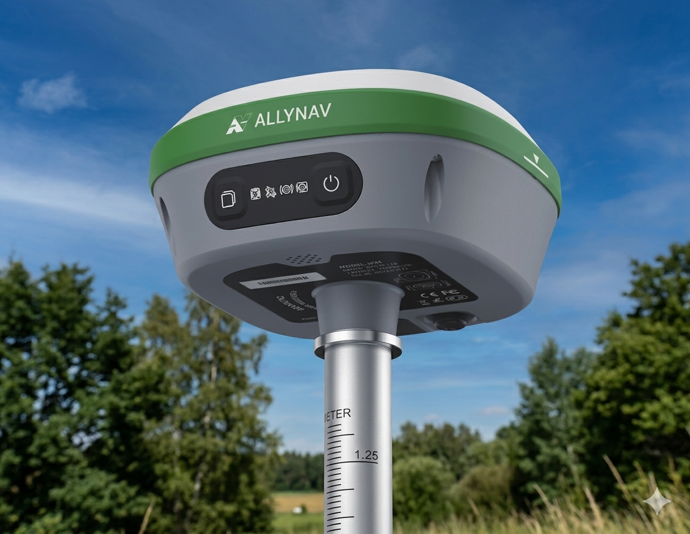

## Organización inicial de la información

El primer paso consiste en organizar los archivos recolectados en campo, separando la información correspondiente al levantamiento estático y la información asociada al levantamiento cinemático RTK.

Para esta práctica se cuenta, en general, con dos grupos principales de archivos:

| Grupo de información | Archivo principal | Propósito |
|---|---|---|
| Levantamiento estático | Archivo TXT generado por el receptor | Conversión a RINEX y postproceso de la base |
| Levantamiento cinemático RTK | Archivos exportados desde AllyPad | Revisión o corrección de las coordenadas levantadas con el rover |

Durante el levantamiento estático, el equipo instalado sobre el punto geodésico registra internamente un archivo en formato **TXT**, el cual contiene las observaciones y datos de navegación capturados durante el tiempo de rastreo. Este archivo debe descargarse desde la memoria interna del receptor para su posterior conversión y procesamiento.

En el levantamiento cinemático RTK, la información se almacena en el colector de datos mediante la aplicación **AllyPad**. Allí se guardan las coordenadas de los puntos levantados, la numeración o nombre del punto, la descripción, la altura, la precisión reportada, la fecha y hora de captura, así como la información de la base desde la cual se recibieron las correcciones.

## Información de campo requerida

Antes de iniciar el postproceso, se debe verificar que la bitácora de campo contenga la información mínima necesaria para configurar correctamente el procesamiento.

Durante la ocupación estática se debe haber registrado:

| Información | Descripción |
|---|---|
| Nombre del punto | Identificación del vértice observado |
| Hora de inicio | Hora en la que comenzó el rastreo estático |
| Hora de finalización | Hora en la que terminó el rastreo |
| Altura de antena | Distancia medida entre la marca de referencia de la antena y el punto físico ocupado |
| Tipo de altura | Indicar si la altura fue medida de forma vertical o inclinada |
| Localización del punto | Descripción de la ubicación de la placa o vértice |
| Condiciones del entorno | Obstáculos, árboles, edificaciones u otros elementos que puedan afectar la señal |
| Condiciones atmosféricas | Estado general del clima durante la observación |
| Esquema de localización | Croquis o descripción gráfica del punto observado |

La correcta medición de la altura de antena es fundamental, ya que un error en este dato se refleja directamente en la altura final obtenida durante el postproceso.


## Conversión del archivo TXT a formato RINEX

Una vez descargado el archivo TXT generado por el receptor durante el rastreo estático, se debe convertir a un formato compatible con aplicaciones de postproceso GNSS. Para esta práctica se utiliza la aplicación **NovAtel Convert**, disponible en el siguiente enlace:

<https://novatel.com/support/support-materials/software-downloads>

El procedimiento general consiste en abrir el archivo TXT desde la aplicación, seleccionar el formato de salida requerido y ejecutar la conversión mediante el botón **Convert**. El archivo puede exportarse, por ejemplo, en formato **RINEX 2.11** o **RINEX 3.1**, según los requerimientos del software de postproceso que se vaya a utilizar.

Como resultado de la conversión se generan archivos RINEX asociados a las observaciones y a la navegación satelital. Estos archivos quedan almacenados normalmente en la misma carpeta donde se encuentra el archivo TXT original.

| Extensión | Contenido |
|---|---|
| `.O` | Archivo de observaciones GNSS |
| `.N` o `.D` | Archivo de navegación satelital |
| `.G` | Archivo de navegación GLONASS, cuando aplica |

Estos archivos constituyen la información básica del punto observado y serán utilizados posteriormente en el software de postproceso.

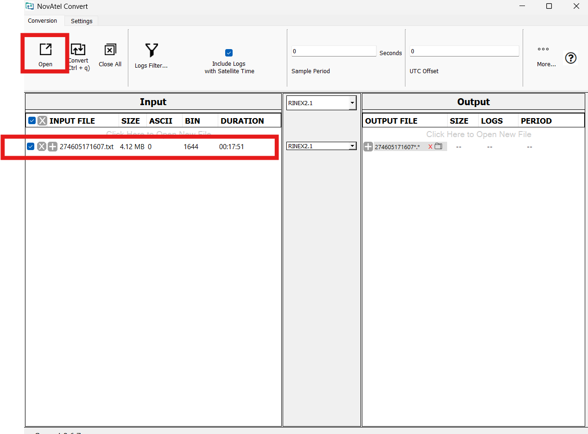

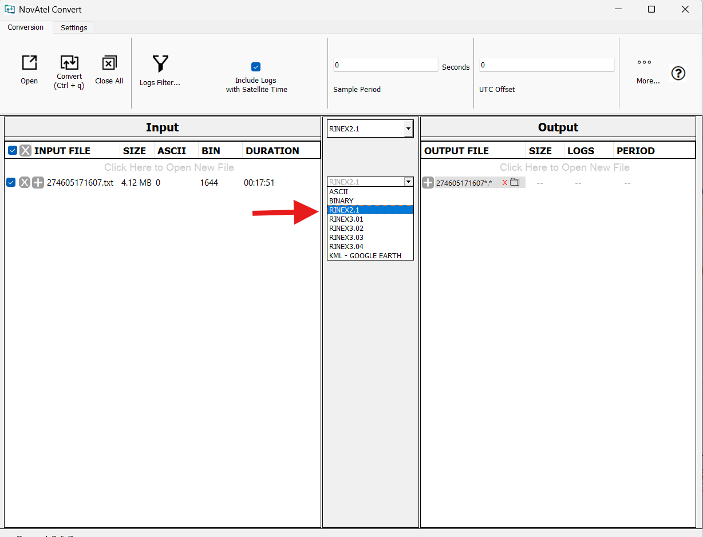

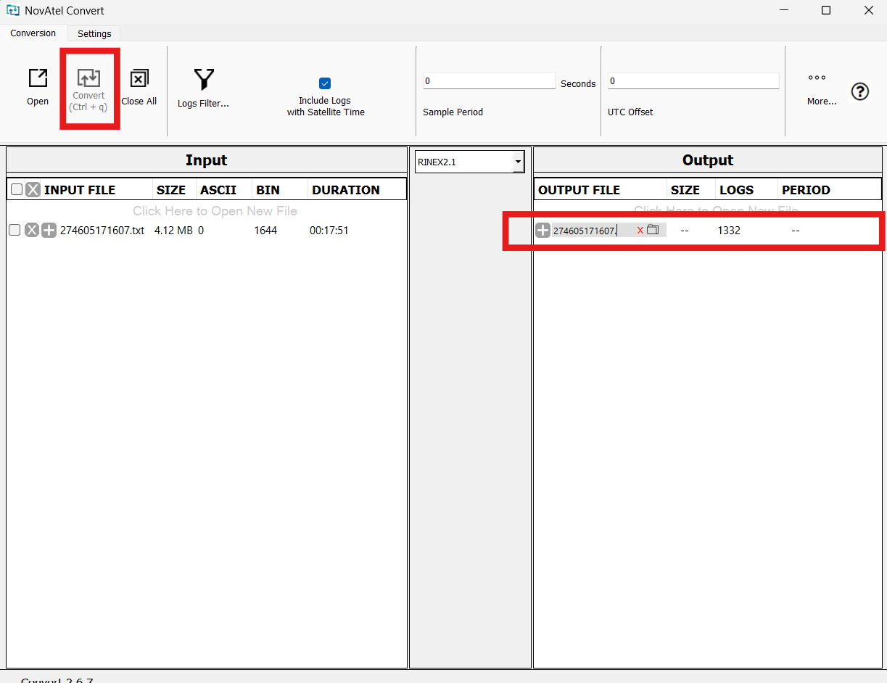

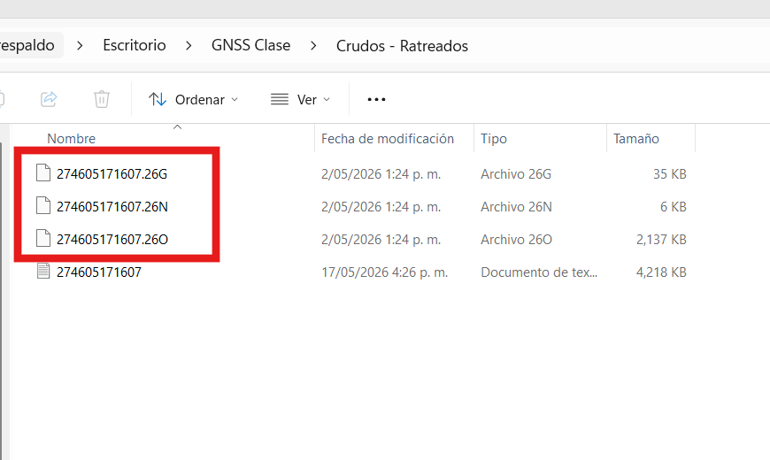

## Descarga de archivos RINEX de una estación permanente del IGAC

Una vez obtenidos los archivos RINEX del punto observado, se deben descargar los archivos RINEX de una estación permanente de referencia perteneciente a la Red Activa GNSS del IGAC.

Para ello se ingresa al geoportal geodésico del IGAC:

<https://redgeodesica.igac.gov.co/red_activa.html>

Desde la Red Activa GNSS se identifica la estación permanente más cercana al punto observado. Para facilitar esta selección, puede emplearse el visor geográfico de la Red Geodésica Nacional, donde se visualizan las estaciones disponibles, su localización, nombre y estado de operación.

Posteriormente, se busca la estación por nombre y se descargan los archivos RINEX correspondientes a la misma fecha del levantamiento. La búsqueda puede realizarse por nombre de estación, fecha calendario, semana GNSS o día del año.

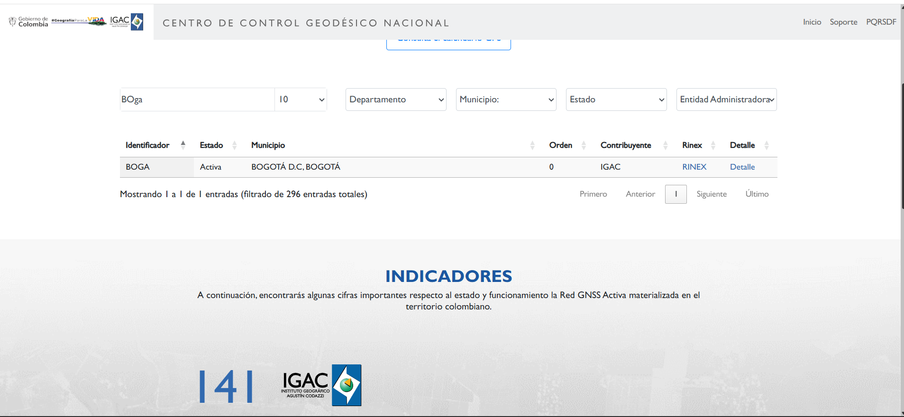

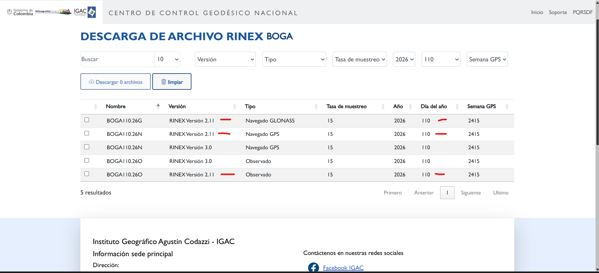

Para esta práctica se emplea la estación **BOGA**, localizada dentro del campus de la Universidad Nacional de Colombia y disponible como estación activa. De esta estación se descargan los archivos RINEX correspondientes al día del levantamiento, en formato **RINEX 2.11**.

Los archivos descargados de la estación permanente se utilizarán como referencia para procesar diferencialmente el punto observado durante la ocupación estática.

## Descarga de efemérides precisas

Adicionalmente, se descargan las **efemérides precisas** correspondientes a la semana GNSS y al día específico del levantamiento. Estas efemérides permiten mejorar la calidad del procesamiento, al utilizar información orbital más precisa que la contenida en los archivos de navegación transmitidos por los satélites.

En esta práctica, el levantamiento fue realizado en la **semana GPS 2415**, día **110**, por lo cual deben descargarse las efemérides precisas correspondientes a dicha semana y fecha.

Por medio de la siguiente página podemos confirmar el numero de la semana GNSS y el dia Calendario que corresponde: https://gnsscalendar.com/

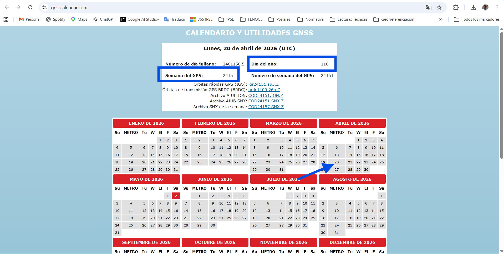

Estas efemérides serán utilizadas en el procesamiento cuando el software lo permita. En particular, se realizará una comparación entre el procesamiento efectuado con una aplicación de libre acceso que no permite incorporar efemérides precisas y el procesamiento realizado con **RTKLIB**, específicamente mediante el módulo **RTKPOST**, donde sí es posible cargarlas.

Acceso a pagina de descarga de Efemérides: https://www.earthdata.nasa.gov/data/space-geodesy-techniques/gnss/precise-orbits-product

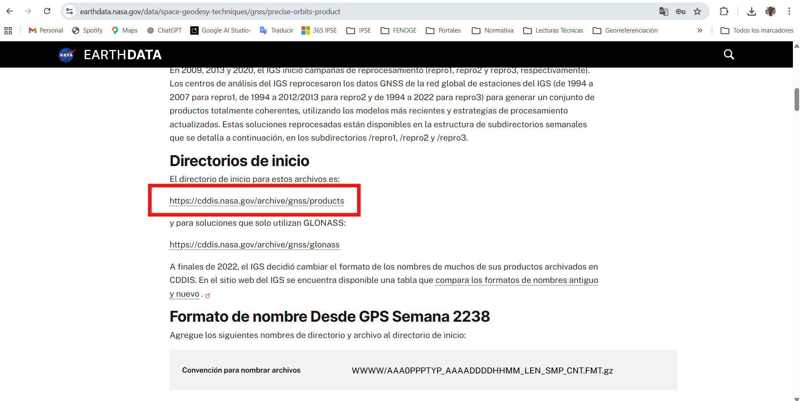

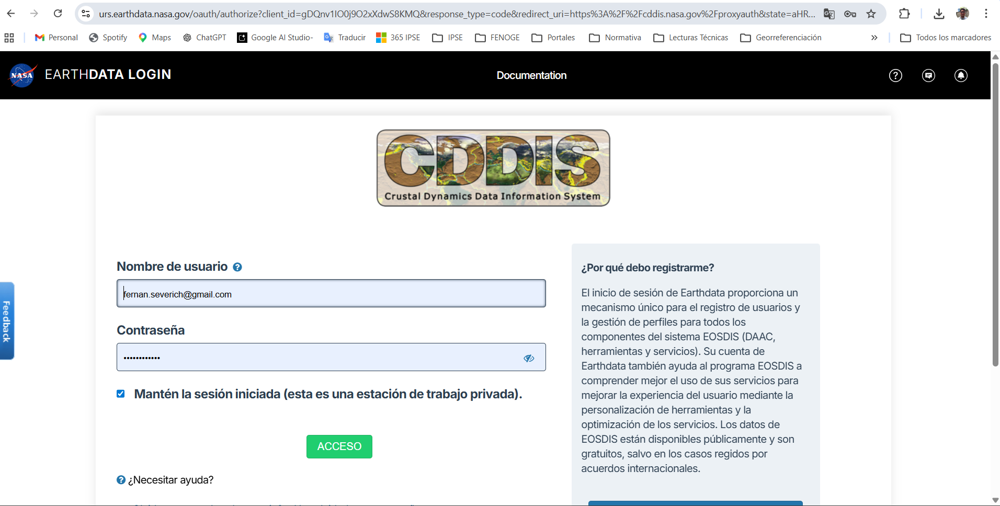

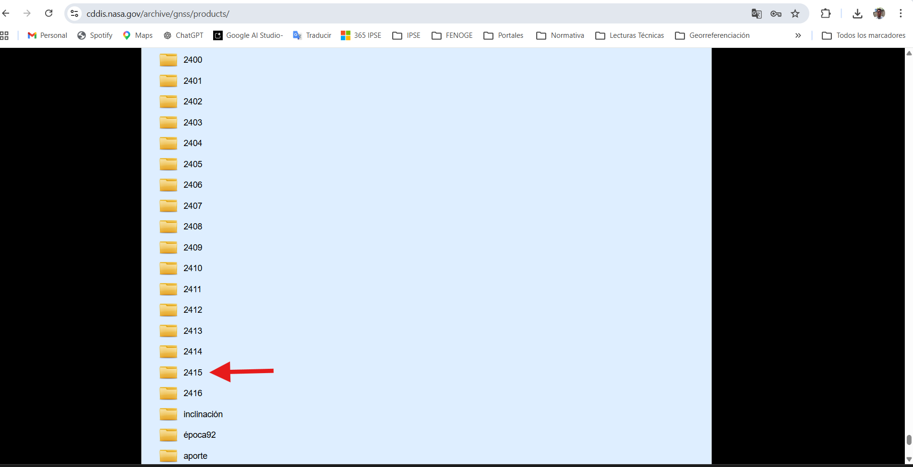

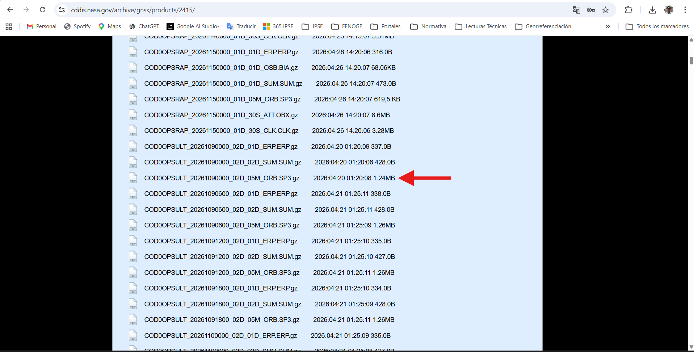

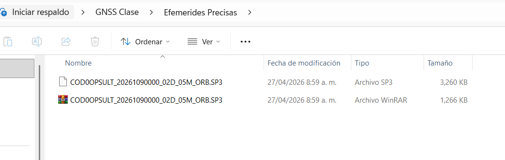

## Postproceso del levantamiento estático

Con los archivos del punto observado, los archivos RINEX de la estación permanente del IGAC, las efemérides precisas y la información de campo debidamente organizada, se procede a realizar el postproceso del levantamiento estático.

El procesamiento puede realizarse mediante diferentes aplicaciones especializadas. En esta práctica se mostrará inicialmente el procedimiento en una aplicación de libre acceso denominada **Emlid Studio**, la cual permite realizar postproceso GNSS de manera sencilla. Sin embargo, debe tenerse en cuenta que esta aplicación no permite incorporar efemérides precisas dentro del procesamiento.

Descarga Emlid Studio: https://emlid.com/es/emlid-studio/

Posteriormente, se realizará el procesamiento en **RTKLIB**, mediante el módulo **RTKPOST**, el cual permite cargar archivos de observación, navegación y efemérides precisas. Esto permitirá comparar los resultados obtenidos con ambos procedimientos y analizar la influencia de los insumos utilizados en la coordenada final procesada.

Descarga RTKLIB: https://github.com/tomojitakasu/RTKLIB_bin/tree/rtklib_2.4.3

El objetivo de esta etapa es obtener una coordenada ajustada para la base observada durante la práctica. Esta coordenada servirá como referencia para revisar o corregir posteriormente las coordenadas del levantamiento cinemático RTK del borde de vía.

### Postproceso del levantamiento estático Emlid Studio.
Se debe seleccionar el tipo de postproceso a realizar en la aplicación:
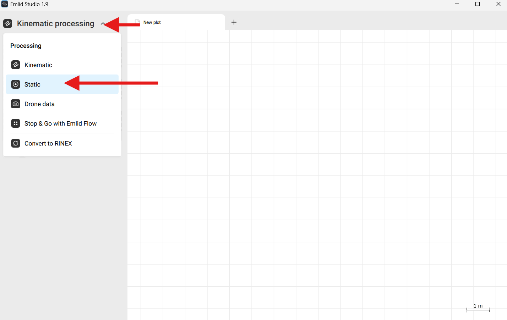

Se importan o cargan los RINEX observados en nuestro levantamiento Estático.

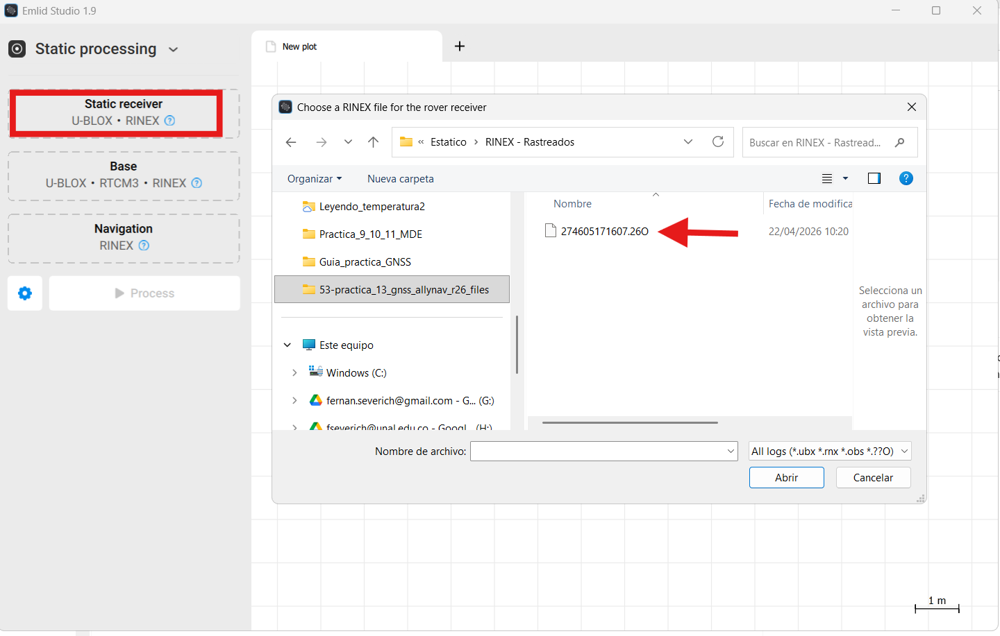

Debido a que durante la descarga de la los archivos RINEX de la base BOGA, se descargaron archivos D, N, G, siendo D, el archivo de observaciones O, la aplicación Emlid Studio no reconoce este archivo. Por tanto es necesario realizar la descarga de los archivos rinex 3.11 de la pagina del IGAC

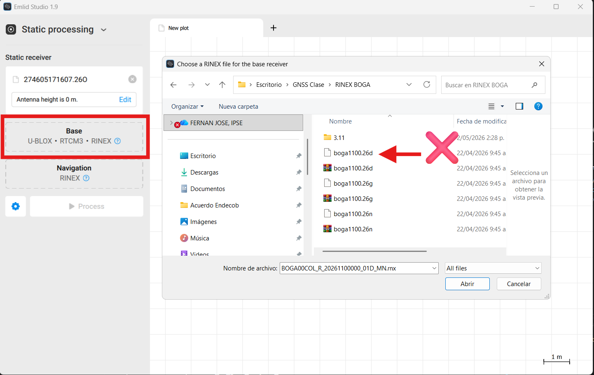

Notese que ahora solo son dos archivos a descargar.

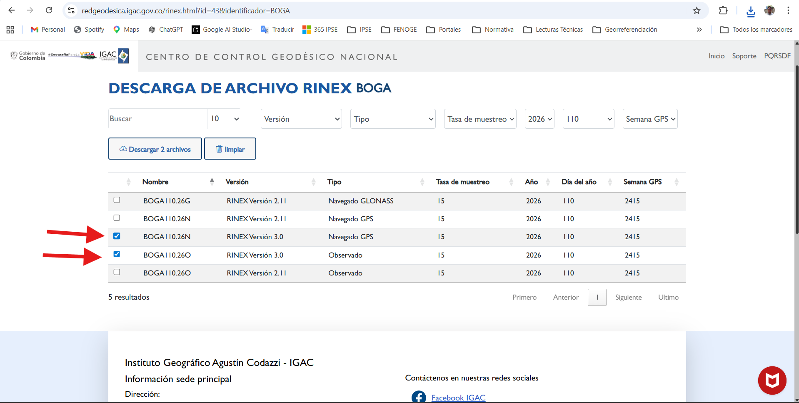

Adicionalmente se recomienda realizar la conversion del archivo crudo del levantamiento estático a RINEX 3.01

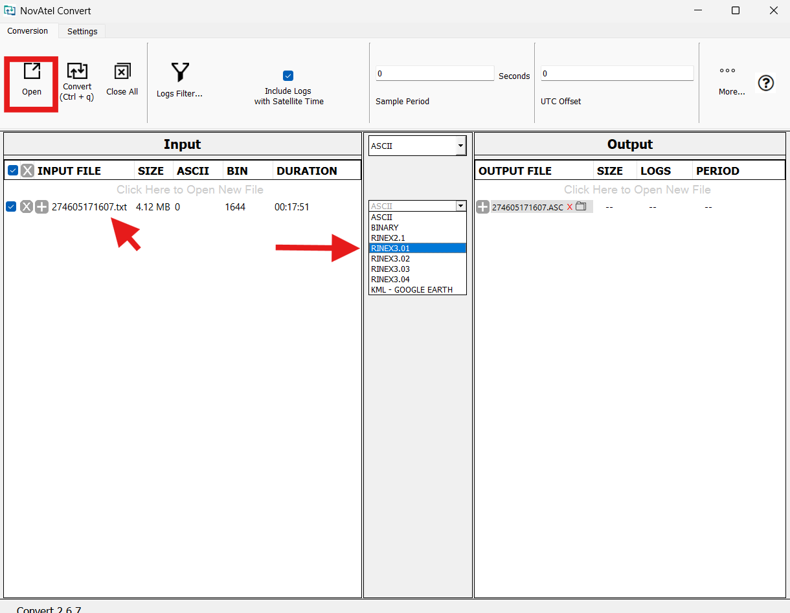

Se puede observar en la siguiente imagen que los archivos RINEX observados en formato 3.11, la extensión del archivo es .rnx

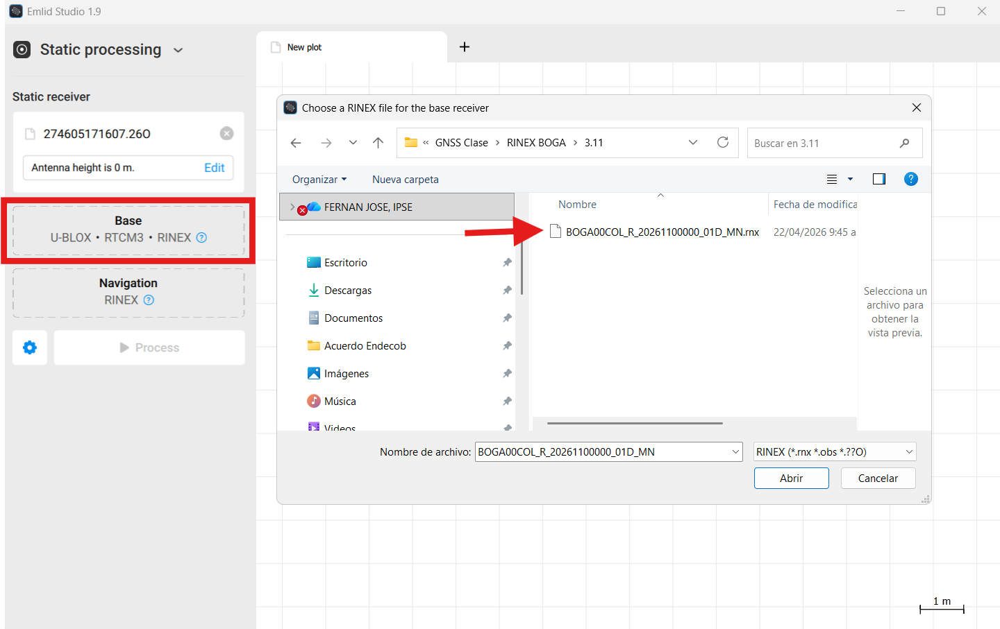

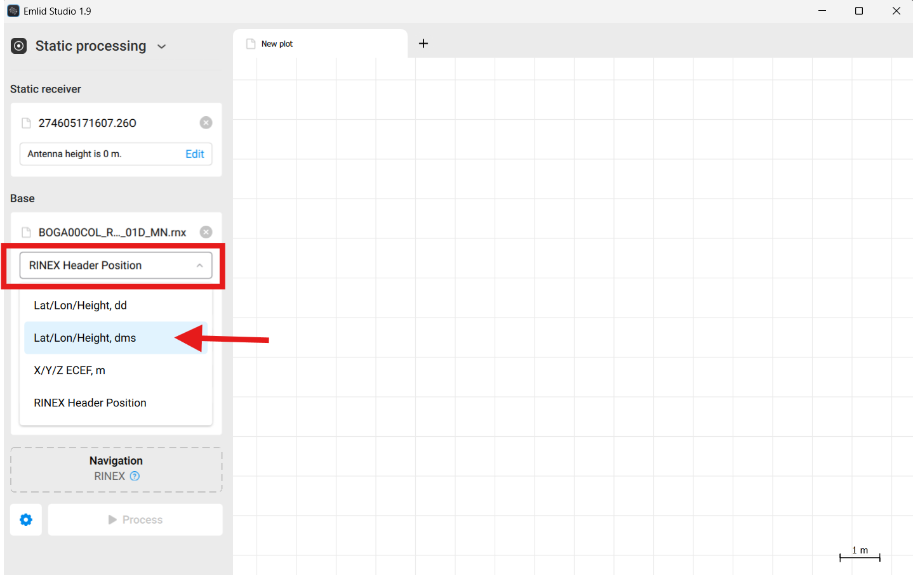

Estas coordenadas a ingresar de la base se localizan en la misma pagina de la red geodesica nacional - Red activa GNSS - Filtrando BOGA - Detalles. Estas se rellenan en los espacios de la aplicación, incluyendo la altura de la antena que tambien se reporta en la página.

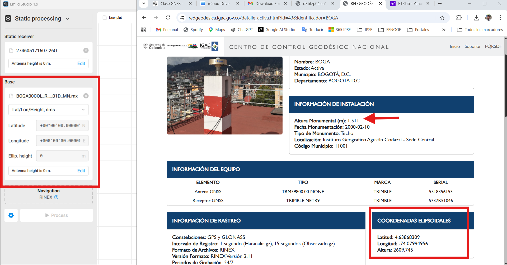

No olvidar tambien introducir la altura de la antena de nuestro equipo sobre vertice DOOf UNAL:

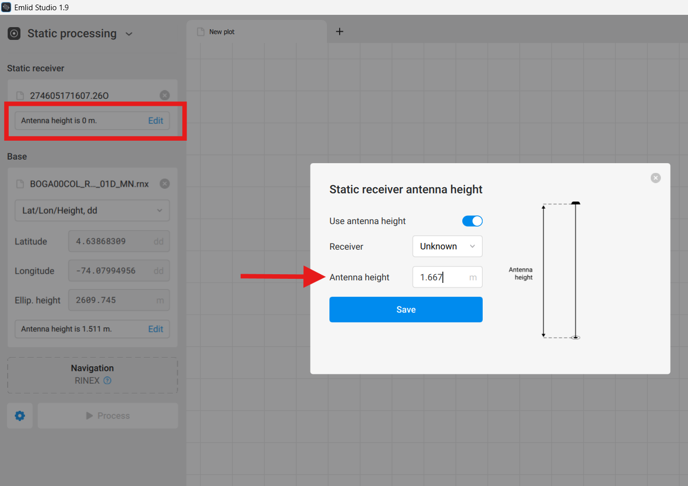

Se cargan los archivos navegados de la estación Base BOGA:

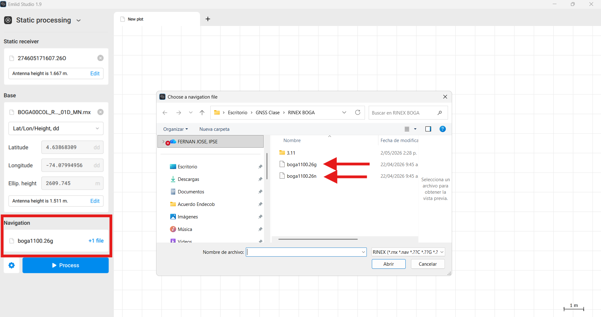

Se realizan configuraciones adicionales, como cambiar la ruta de guardado y nombre del archivo resultado del postproceso, el lapso de tiempo del levantamiento (para este dato se puede abrir los archivos de observacion y ver los tiempos), tambien se pueden modificar las constelaciones de satelites a procesar (GPS, GLONASS, GALILEO, BEIDOU, SBAS...etc) el formato de salida de coordenadas y tiempo.

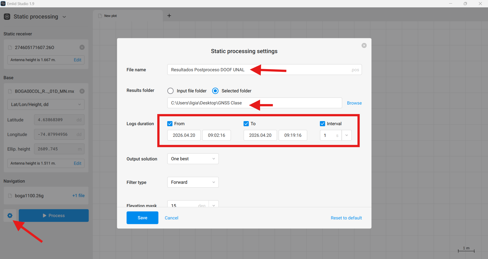

### Postproceso del levantamiento estático con RTKLIB
RTKLIB - Trae la aplicación de RTKPOST para realizar postproceso.
RTKPOST permite procesar observaciones GNSS diferenciales a partir de un punto observado y una estación base de referencia. Para esta práctica, el punto observado corresponde al receptor instalado sobre el vértice geodésico de la Universidad Nacional, mientras que la estación base corresponde a la estación permanente **BOGA** del IGAC.

**Configuración inicial de RTKPOST**: Al abrir RTKPOST se despliega la ventana principal del aplicativo. En esta ventana se deben activar las casillas **Time Start** y **Time End**, correspondientes al tiempo de inicio y finalización del rastreo estático.

Para esta práctica, el levantamiento fue realizado el día **20 de abril de 2026**. Al revisar los archivos de observación, se identifica que el rastreo inició a las **14:02:16 GPST** y finalizó a las **14:20:07 GPST**. Por tanto, estos son los valores que deben ingresarse en la ventana inicial de RTKPOST.

El intervalo de procesamiento se configura en **1 segundo**, dado que el levantamiento estático fue realizado con una frecuencia de registro de **1 Hz**, equivalente a una observación por segundo.

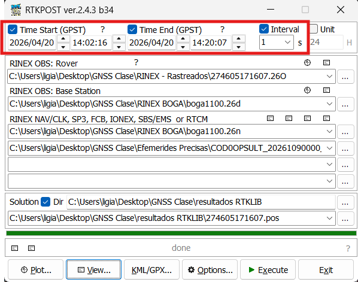

En la ventana principal también se deben cargar los archivos de entrada requeridos para el procesamiento:

| Campo en RTKPOST | Archivo a cargar | Descripción |
|---|---|---|
| RINEX OBS: Rover | Archivo de observación del punto levantado | Corresponde al RINEX del receptor ubicado sobre el vértice observado |
| RINEX OBS: Base Station | Archivo de observación de la estación BOGA | Corresponde al RINEX de la estación permanente del IGAC |
| RINEX NAV/CLK, SP3, etc. | Archivo de navegación | Se carga el archivo de navegación de la estación BOGA |
| RINEX NAV/CLK, SP3, etc. | Efemérides precisas | Se carga el archivo de efemérides precisas descargado para la semana GNSS y día correspondiente |

::: {#fig-RTKLIB layout-ncol=2}

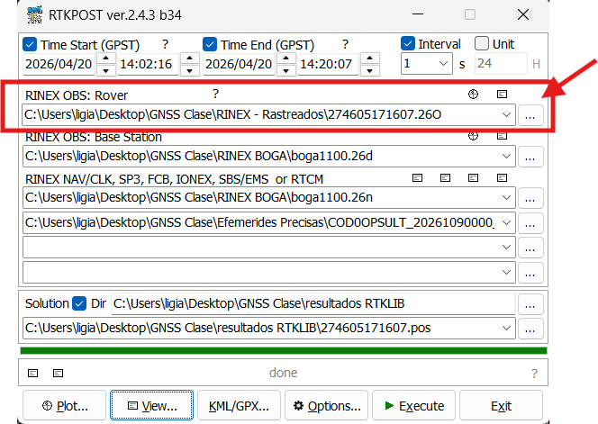{#fig-Vertice}

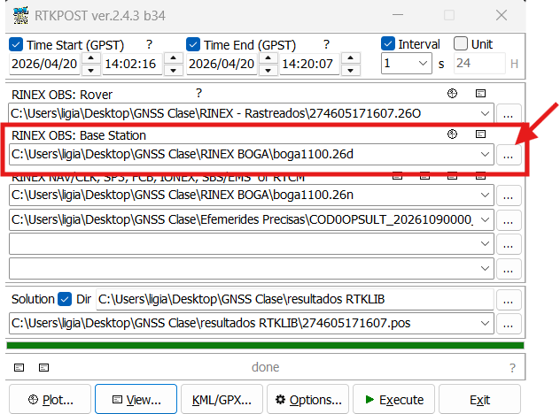{#fig-rover_V}

Fotos de app RTKPOST.
:::

::: {#fig-RTKLIB2 layout-ncol=2}

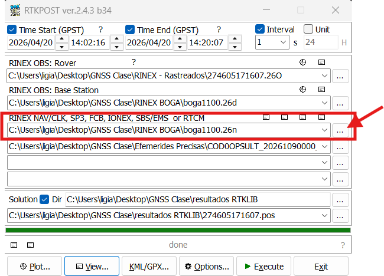{#fig-Vertice}

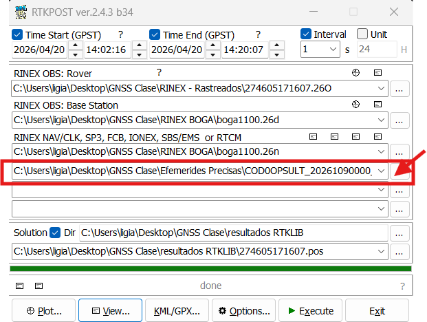{#fig-rover_V}

Fotos de app RTKPOST.
:::

En la sección **Solution**, se selecciona la carpeta donde se guardarán los resultados del procesamiento. RTKPOST genera un archivo de salida con extensión `.pos`, en el cual se almacenan las coordenadas resultantes y la información de calidad de la solución.

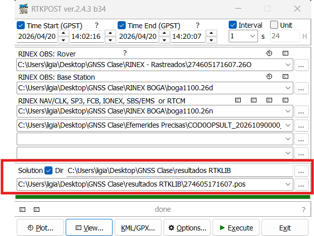

**Configuración del modo de posicionamiento** Luego de cargar los archivos de entrada, se ingresa al botón **Options**. En la pestaña **Setting1** se configura el modo general del procesamiento.

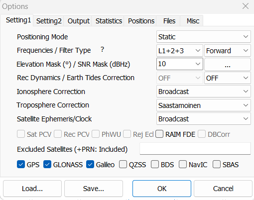

Para esta práctica se selecciona el modo de posicionamiento **Static**, dado que se está procesando una ocupación estática sobre un punto fijo. En el campo **Frequencies / Filter Type** se seleccionan las frecuencias disponibles del receptor GNSS utilizadas durante el rastreo. En este caso se emplea la opción **L1+2+3**.

La máscara de elevación se configura en **10°**, valor que debe coincidir con la máscara utilizada durante la medición en campo. En cuanto a las constelaciones, se seleccionan **GPS**, **GLONASS** y **Galileo**, correspondientes a las señales que se desean considerar en el procesamiento.

En esta misma pestaña se mantienen las siguientes opciones generales:

| Parámetro | Configuración usada |
|---|---|
| Positioning Mode | Static |
| Frequencies / Filter Type | L1+2+3 |
| Elevation Mask | 10° |
| Ionosphere Correction | Broadcast |
| Troposphere Correction | Saastamoinen |
| Satellite Ephemeris/Clock | Broadcast |
| Constelaciones | GPS, GLONASS y Galileo |

**Configuración de ambigüedades** En la pestaña **Setting2** se revisan los parámetros asociados a la resolución de ambigüedades. Para esta práctica no se realizaron modificaciones respecto a la configuración por defecto.

Se mantiene la resolución de ambigüedades en modo continuo, con la opción correspondiente activada. Esta configuración permite que el programa gestione la resolución de ambigüedades durante el procesamiento de la línea base.

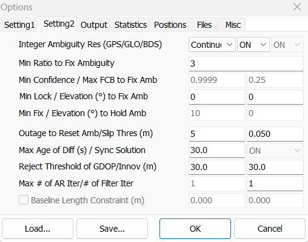

**Configuración del formato de salida** En la pestaña **Output** se define el formato de los resultados. Para esta práctica se selecciona como formato de solución **Lat/Lon/Height**, con el fin de obtener las coordenadas finales en latitud, longitud y altura.

El formato de tiempo se deja en **hh:mm:ss GPST**, y el formato de latitud y longitud se define en **grados decimales**. El datum se configura como **WGS84** y la altura se mantiene como **elipsoidal**.

Es importante cambiar la opción **Solution for Static Mode** a **Single**, de manera que el procesamiento entregue una única coordenada final para el punto observado.

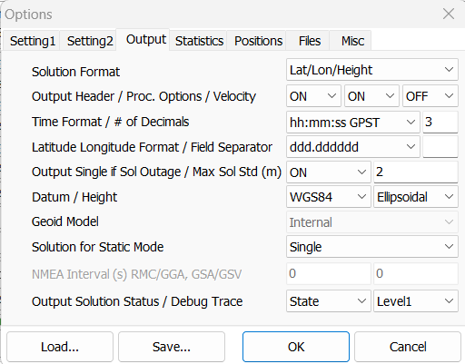

La configuración usada en esta pestaña se resume así:

| Parámetro | Configuración usada |
|---|---|
| Solution Format | Lat/Lon/Height |
| Time Format | hh:mm:ss GPST |
| Latitude/Longitude Format | Grados decimales |
| Datum | WGS84 |
| Height | Ellipsoidal |
| Solution for Static Mode | Single |

**Parámetros estadísticos** En la pestaña **Statistics** se revisan los parámetros estadísticos asociados al procesamiento. Para esta práctica no se realizaron modificaciones en esta sección, conservando los valores definidos por defecto en RTKPOST.

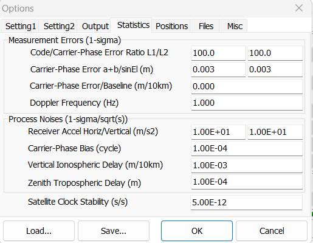

**Configuración de posiciones y alturas de antena** En la pestaña **Positions** se configuran las posiciones del rover y de la estación base. Para el caso de esta práctica, el **rover** corresponde al punto observado sobre el vértice geodésico, mientras que la **Base Station** corresponde a la estación permanente **BOGA** del IGAC.

En el campo del rover se debe ingresar la altura de antena medida durante la práctica, correspondiente a la distancia entre el punto físico ocupado y la marca de referencia del receptor. Es fundamental verificar si la altura fue medida de forma vertical o inclinada, ya que este dato influye directamente en la altura final del punto procesado.

En la sección **Base Station** se ingresan las coordenadas oficiales de la estación BOGA, descargadas desde la página de la Red Geodésica del IGAC. También se debe ingresar la altura de antena correspondiente a dicha estación, de acuerdo con la información disponible para la fecha del levantamiento.

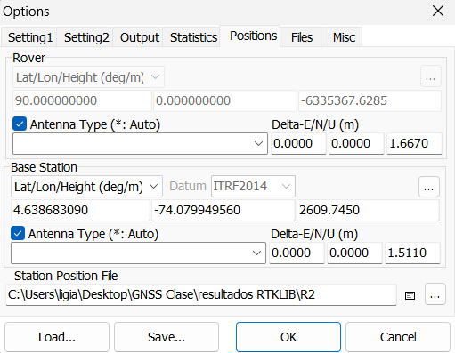

Para esta práctica se emplearon como referencia las coordenadas de la estación BOGA en latitud, longitud y altura elipsoidal. Una vez ingresada esta información, se selecciona la carpeta o archivo donde se almacenarán los resultados del procesamiento.

**Ejecución del postproceso** Después de configurar los archivos de entrada, el intervalo temporal, las opciones de procesamiento, el formato de salida y las posiciones de referencia, se regresa a la ventana principal de RTKPOST y se presiona el botón **Execute**.

El programa ejecuta el procesamiento y, al finalizar, muestra la barra de progreso completa con el mensaje **done**. Esto indica que el archivo de resultados fue generado correctamente en la ruta definida.

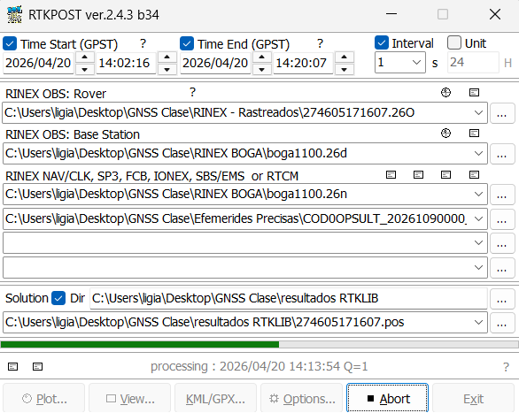

**Revisión de resultados** Finalizado el procesamiento, se abre el archivo `.pos` generado por RTKPOST. Este archivo contiene el resumen del procesamiento, los archivos utilizados, el intervalo de observación, el modo de posicionamiento, las constelaciones empleadas, las opciones de corrección y la coordenada resultante.

En los resultados se debe revisar la coordenada final obtenida para el punto observado, así como los indicadores de calidad del procesamiento. Entre los parámetros más importantes se encuentran:

| Parámetro | Descripción |
|---|---|
| Latitude | Latitud final del punto observado |
| Longitude | Longitud final del punto observado |
| Height | Altura elipsoidal final |
| Q | Calidad de la solución |
| ns | Número de satélites utilizados |
| sdn, sde, sdu | Desviaciones estándar en norte, este y altura |
| ratio | Indicador asociado a la solución de ambigüedades |

En RTKPOST, el campo **Q** permite identificar el tipo de solución obtenida. De acuerdo con la leyenda del archivo de resultados, los valores más comunes son:

| Valor Q | Tipo de solución |
|---|---|
| 1 | Fija |
| 2 | Flotante |
| 5 | Simple |

Para esta práctica, el archivo de salida permite visualizar las coordenadas finales del punto observado y la calidad de la solución obtenida. Estos valores serán utilizados posteriormente para comparar la coordenada postprocesada de la base con la coordenada utilizada en campo durante el levantamiento RTK.

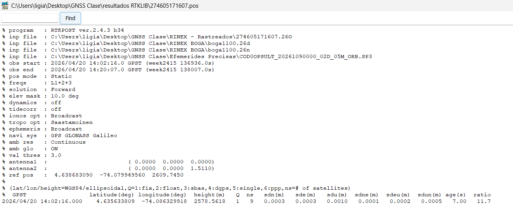

La coordenada obtenida mediante RTKPOST corresponde a la coordenada ajustada del punto observado durante el levantamiento estático. Esta coordenada debe compararse con la coordenada inicialmente utilizada para configurar la estación base durante el levantamiento RTK.

Si existe una diferencia entre ambas coordenadas, se calcula el desplazamiento en Este, Norte y altura. Posteriormente, dicho desplazamiento puede aplicarse a los puntos levantados en modo cinemático RTK, con el fin de mejorar el amarre absoluto del levantamiento al sistema de referencia utilizado.

En síntesis, el postproceso con RTKPOST permite:

| Resultado | Utilidad |
|---|---|
| Obtener la coordenada final de la base | Sirve como coordenada corregida del punto ocupado |
| Revisar la calidad de la solución | Permite evaluar si el procesamiento fue fijo, flotante o simple |
| Comparar contra la coordenada usada en campo | Permite identificar desplazamientos |
| Corregir el levantamiento RTK | Permite trasladar los puntos rover según el ajuste de la base |

### Resultados de los postprocesos realizados con las diferentes aplicaciones

Como resultado del postproceso se obtiene una coordenada final para el punto observado durante el levantamiento estático. Esta coordenada debe revisarse junto con los indicadores de calidad reportados por el software, tales como precisión estimada, tipo de solución, residuos, número de satélites utilizados y consistencia general del procesamiento.

La coordenada obtenida mediante postproceso debe compararse con la coordenada que fue utilizada inicialmente para configurar la estación base durante el levantamiento RTK. Esta comparación permite determinar si existe un desplazamiento en Este, Norte y altura.

### Con Emlid Studio
La solución resultado de este postproceso fue single (5) significa que no fue precisa. "Revisar"

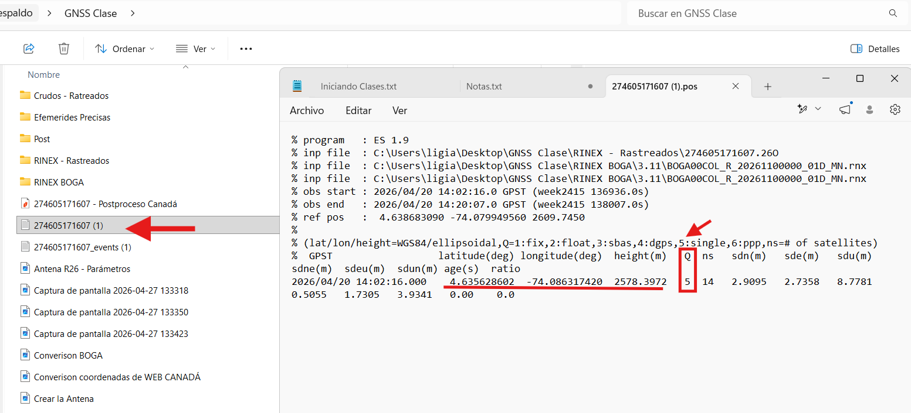

A continuación se presentan las coordenadas obtenidas según el archivo de registro procesado con EMLID STUDIO:

| Latitud (deg) | Longitud (deg) | Altura Elipsoidal (m) | Calidad (Q) | Satélites (ns) |
|:---:|:---:|:---:|:---:|:---:|
| 4.635628602 | -74.086317420 | 2578.3972 | 5 (Single) | 14 |

: Coordenadas extraídas del archivo 274605171607 (1).pos {#tbl-gnss-results}

- Precisiones Estimadas (Desviación Estándar)

| Componente | Valor (m) |
|:---|:---:|
| Norte (sdn) | 2.9095 |
| Este (sde) | 2.7358 |
| Vertical (sdu) | 8.7781 |

: Errores estándar del posicionamiento {#tbl-precision}

### Con RTKLIB

Se obtuvo una solución **estática fija (Fix)** mediante RTKPOST, procesando el archivo de observación del punto levantado contra la estación permanente **BOGA** del IGAC. En el procesamiento se cargaron los archivos RINEX de observación, navegación y el archivo de efemérides precisas (`.sp3`). No obstante, en la configuración mostrada, RTKPOST reporta el uso de efemérides en modo **Broadcast**, por lo cual debe verificarse en las opciones del procesamiento que las efemérides precisas hayan sido efectivamente empleadas.

Coordenadas geodésicas obtenidas en WGS84, con altura elipsoidal:

| Parámetro | Valor obtenido |
|:---|:---:|
| **Latitud** | 4.635633809° |
| **Longitud** | -74.086329918° |
| **Altura elipsoidal** | 2576.8939 m |
| **Calidad (Q)** | 1 (Fix) |
| **Satélites (ns)** | 9 |

: Coordenadas finales obtenidas mediante RTKPOST {#tbl-fix-results}

Indicadores de calidad y precisión:

La solución presenta una condición favorable de procesamiento, evidenciada por la obtención de solución fija, desviaciones estándar reducidas y un valor de **Ratio** superior al umbral mínimo configurado de 3.0.

| Componente | Desviación estándar (m) |
|:---|:---:|
| **Norte (sdn)** | 0.0003 |
| **Este (sde)** | 0.0003 |
| **Vertical (sdu)** | 0.0010 |
| **Este-Norte (sdne)** | 0.0001 |
| **Este-Vertical (sdeu)** | 0.0002 |
| **Vertical-Norte (sdun)** | 0.0005 |
| **Edad de corrección (age)** | 7.00 s |
| **Ratio Test** | 11.6 |

: Indicadores de calidad de la solución RTKPOST {#tbl-rtklib-quality}


### Corrección del levantamiento cinemático RTK

Una vez obtenida la coordenada postprocesada de la base, se puede revisar el levantamiento cinemático RTK. Debido a que los puntos del borde de vía fueron levantados tomando como referencia la base instalada en campo, cualquier desplazamiento identificado en la coordenada de la base puede trasladarse a los puntos RTK.

En términos generales, la corrección consiste en calcular la diferencia entre la coordenada inicial de la base y la coordenada postprocesada, y aplicar ese desplazamiento a las coordenadas de los puntos levantados con el rover.

## Síntesis del flujo de trabajo

El flujo general del postproceso desarrollado en la práctica se resume de la siguiente manera:

| Etapa | Descripción |
|---|---|
| 1. Organización de información | Separar archivos del levantamiento estático, archivos RINEX, datos crudos, archivos de navegación, efemérides y archivos RTK exportados desde AllyPad |
| 2. Conversión a RINEX | Convertir el archivo TXT del receptor a formato RINEX mediante NovAtel Convert |
| 3. Descarga de estación permanente | Descargar los archivos RINEX de la estación permanente BOGA del IGAC para la misma fecha del levantamiento |
| 4. Descarga de efemérides | Descargar efemérides precisas correspondientes a la semana GNSS y día del levantamiento |
| 5. Procesamiento estático | Procesar la ocupación estática de la base en Emlid Studio y RTKPOST |
| 6. Obtención de coordenada corregida | Obtener la coordenada postprocesada de la base y revisar su precisión |
| 7. Comparación de base | Comparar la coordenada usada en campo con la coordenada obtenida mediante postproceso |
| 8. Corrección RTK | Aplicar el desplazamiento de la base a los puntos levantados en modo cinemático |
| 9. Revisión final | Verificar coordenadas, alturas, descripciones, precisión reportada y consistencia espacial de los puntos levantados |

## Recomendaciones/recursos adicionales para el postproceso

* Uso del software [Leica Geo Office](https://leica-geosystems.com/es-es/rugbycl/archive-data/software/leica-geo-office) (licenciado)

* **RTKLIB** es un paquete de software libre y de código abierto diseñado para el posicionamiento preciso mediante sistemas globales de navegación por satélite (GNSS), como GPS, GLONASS, Galileo, BeiDou y QZSS. Permite procesar datos en tiempo real (RTK) o postprocesamiento (PPK) para obtener precisiones centimétricas, siendo ampliamente utilizado en topografía, drones y agricultura de precisió

* Página para identificar la fecha GNSS del levantamiento: [https://gnsscalendar.com/](https://gnsscalendar.com/)

* https://redgeodesica.igac.gov.co/red_activa.html

# Actividad final: comparación de resultados y corrección del levantamiento RTK

Como actividad final de la práctica, el estudiante deberá comparar los resultados obtenidos mediante los diferentes procedimientos de postproceso y analizar su relación con las coordenadas oficiales del vértice geodésico observado. Adicionalmente, deberá corregir el levantamiento cinemático RTK del borde de vía con base en las coordenadas oficiales del vértice, representarlo sobre un mapa base y comentar la precisión del levantamiento.

## Objetivo de la actividad

Comparar las coordenadas proyectadas planas obtenidas mediante diferentes herramientas de postproceso GNSS, contrastarlas con las coordenadas oficiales del vértice observado y aplicar una corrección al levantamiento cinemático RTK a partir del desplazamiento identificado en la estación base.

## Información que debe utilizar el estudiante

Para desarrollar la actividad, el estudiante deberá utilizar como mínimo la siguiente información:

* Coordenadas oficiales del vértice geodésico observado.
* Coordenadas obtenidas mediante postproceso en **Emlid Studio**.
* Coordenadas obtenidas mediante postproceso en **RTKLIB / RTKPOST**.
* Coordenadas obtenidas mediante el servicio canadiense **CSRS-PPP**.
* Coordenadas del levantamiento cinemático RTK exportadas desde el colector de datos.
* Coordenadas utilizadas en campo para configurar la estación base RTK.

El servicio canadiense **CSRS-PPP** puede consultarse en el siguiente enlace:

<https://webapp.csrs-scrs.nrcan-rncan.gc.ca/geod/account-compte/login.php>

Como soporte de la actividad, se deberá incluir una imagen o tabla con las coordenadas oficiales del vértice geodésico observado.


## Parte 1. Comparación de coordenadas proyectadas

El estudiante deberá proyectar a coordenadas planas los resultados obtenidos en los diferentes postprocesos. Para esta práctica se recomienda trabajar en el sistema **MAGNA-SIRGAS / Origen Nacional**, salvo que el docente indique otro sistema de referencia.

Una vez proyectadas las coordenadas, se deberá completar la siguiente tabla:

| Fuente del resultado | Este (m) | Norte (m) | Altura (m) | Δ Este (m) | Δ Norte (m) | Δ Altura (m) | Observación |
|---|---:|---:|---:|---:|---:|---:|---|
| Coordenada oficial del vértice |  |  |  | 0.000 | 0.000 | 0.000 | Coordenada de referencia |
| Emlid Studio |  |  |  |  |  |  | Indicar calidad de solución |
| RTKLIB / RTKPOST |  |  |  |  |  |  | Indicar si fue Fix, Float o Single |
| CSRS-PPP Canadá |  |  |  |  |  |  | Resultado del servicio web |
| Otro procesamiento |  |  |  |  |  |  | Opcional |

: Tabla para comparación de coordenadas proyectadas del vértice observado {#tbl-comparacion-postprocesos}

Las diferencias deberán calcularse respecto a la coordenada oficial del vértice:

$$
\Delta E = E_{postproceso} - E_{oficial}
$$

$$
\Delta N = N_{postproceso} - N_{oficial}
$$

$$
\Delta H = H_{postproceso} - H_{oficial}
$$

Donde:

* $\Delta E$ corresponde a la diferencia en coordenada Este.
* $\Delta N$ corresponde a la diferencia en coordenada Norte.
* $\Delta H$ corresponde a la diferencia en altura.
* $E_{oficial}$, $N_{oficial}$ y $H_{oficial}$ corresponden a las coordenadas oficiales del vértice observado.

## Parte 2. Cálculo del error horizontal

Con base en las diferencias calculadas, el estudiante deberá estimar el error horizontal de cada resultado de postproceso mediante la siguiente expresión:

$$
e_h = \sqrt{(\Delta E)^2 + (\Delta N)^2}
$$

Luego, deberá completar la siguiente tabla:

| Fuente del resultado | Δ Este (m) | Δ Norte (m) | Error horizontal $e_h$ (m) | Δ Altura (m) | Comentario |
|---|---:|---:|---:|---:|---|
| Emlid Studio |  |  |  |  |  |
| RTKLIB / RTKPOST |  |  |  |  |  |
| CSRS-PPP Canadá |  |  |  |  |  |
| Otro procesamiento |  |  |  |  |  |

: Tabla para resumen de errores respecto a la coordenada oficial {#tbl-errores-postprocesos}

El estudiante deberá comentar cuál de los métodos presentó menor diferencia respecto a la coordenada oficial y si los resultados son coherentes con la calidad de solución reportada por cada software.

## Parte 3. Corrección del levantamiento cinemático RTK

Como punto adicional, el estudiante deberá corregir el levantamiento cinemático RTK del borde de vía tomando como referencia las coordenadas oficiales del vértice geodésico observado.

Para ello, deberá comparar la coordenada utilizada en campo para configurar la estación base con la coordenada oficial del vértice. A partir de esa comparación se obtendrá el desplazamiento que deberá aplicarse a todos los puntos levantados con el rover.

El desplazamiento de la base se calcula así:

$$
\Delta E_{base} = E_{oficial} - E_{base\_campo}
$$

$$
\Delta N_{base} = N_{oficial} - N_{base\_campo}
$$

$$
\Delta H_{base} = H_{oficial} - H_{base\_campo}
$$

Luego, para cada punto del levantamiento cinemático RTK, se deberán calcular las coordenadas corregidas:

$$
E_{corr} = E_{RTK} + \Delta E_{base}
$$

$$
N_{corr} = N_{RTK} + \Delta N_{base}
$$

$$
H_{corr} = H_{RTK} + \Delta H_{base}
$$

Donde:

* $E_{base\_campo}$, $N_{base\_campo}$ y $H_{base\_campo}$ corresponden a las coordenadas usadas en campo para configurar la base.
* $E_{oficial}$, $N_{oficial}$ y $H_{oficial}$ corresponden a las coordenadas oficiales del vértice.
* $E_{RTK}$, $N_{RTK}$ y $H_{RTK}$ corresponden a las coordenadas originales levantadas con el rover.
* $E_{corr}$, $N_{corr}$ y $H_{corr}$ corresponden a las coordenadas corregidas del levantamiento RTK.

El estudiante deberá completar una tabla como la siguiente:

| Punto | Este RTK (m) | Norte RTK (m) | Altura RTK (m) | Este corregido (m) | Norte corregido (m) | Altura corregida (m) | Descripción |
|---|---:|---:|---:|---:|---:|---:|---|
| P1 |  |  |  |  |  |  |  |
| P2 |  |  |  |  |  |  |  |
| P3 |  |  |  |  |  |  |  |
| P4 |  |  |  |  |  |  |  |

: Tabla para corrección de puntos levantados mediante RTK {#tbl-correccion-rtk}

## Parte 4. Representación sobre mapa base

Una vez corregidas las coordenadas del levantamiento cinemático RTK, el estudiante deberá representar el trazado del borde de vía sobre un mapa base.

La representación podrá realizarse en un software SIG, como **QGIS** o **ArcGIS**, o mediante una herramienta compatible con archivos CSV, TXT, KML, GeoJSON o shapefile.

El mapa deberá incluir como mínimo:

* Puntos RTK originales.
* Puntos RTK corregidos.
* Vértice geodésico utilizado como base.
* Mapa base de referencia.
* Sistema de coordenadas empleado.
* Leyenda.
* Escala gráfica.
* Norte.
* Comentario sobre la coherencia espacial del levantamiento.


## Parte 5. Comentario técnico

Finalmente, el estudiante deberá redactar un comentario técnico breve sobre la precisión y consistencia del levantamiento realizado.

El comentario deberá responder, como mínimo, las siguientes preguntas:

* ¿Cuál fue la diferencia entre las coordenadas oficiales y las coordenadas obtenidas por cada método de postproceso?
* ¿Qué método presentó mejores resultados respecto a la coordenada oficial?
* ¿La solución obtenida fue fija, flotante o simple?
* ¿La precisión reportada por el software es coherente con las diferencias observadas?
* ¿La corrección aplicada al levantamiento RTK mejoró el amarre absoluto de los puntos?
* ¿El levantamiento RTK conserva coherencia geométrica sobre el mapa base?
* ¿Qué factores pudieron afectar la precisión del levantamiento?

## Entregables

El estudiante deberá entregar los siguientes productos:

| Entregable | Descripción |
|---|---|
| Tabla de comparación de coordenadas | Comparación entre coordenadas oficiales, Emlid Studio, RTKLIB / RTKPOST, CSRS-PPP y otros resultados |
| Tabla de errores | Diferencias en Este, Norte, altura y error horizontal |
| Tabla de corrección RTK | Coordenadas originales y corregidas del levantamiento cinemático |
| Mapa base | Representación del levantamiento RTK original y corregido |
| Comentario técnico | Análisis de precisión, calidad de solución y coherencia espacial |

: Entregables de la actividad final {#tbl-entregables-tarea}