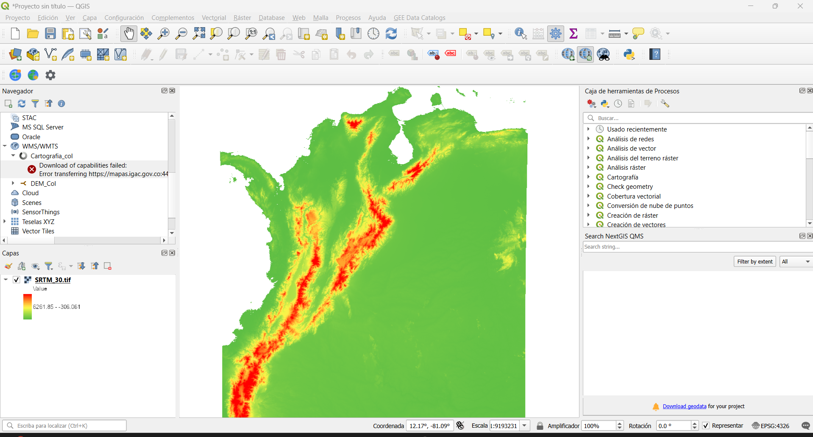
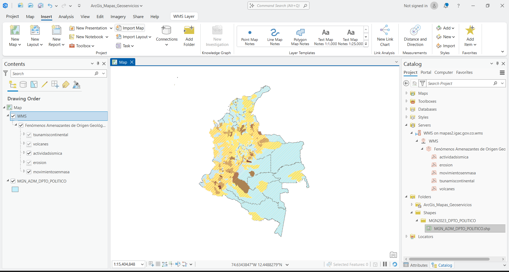
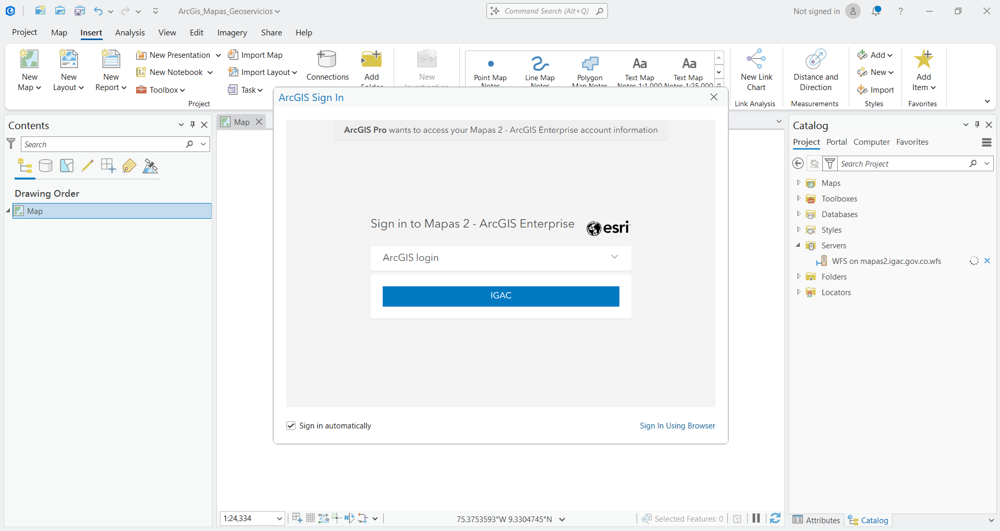
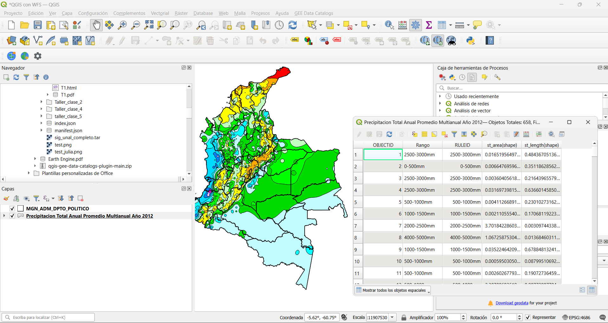
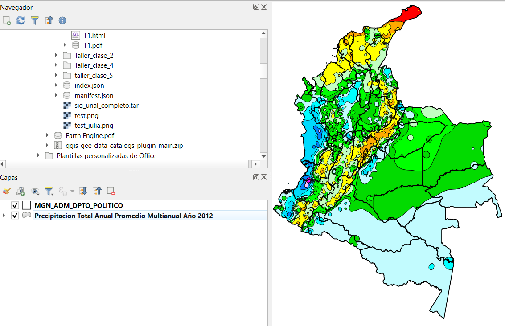
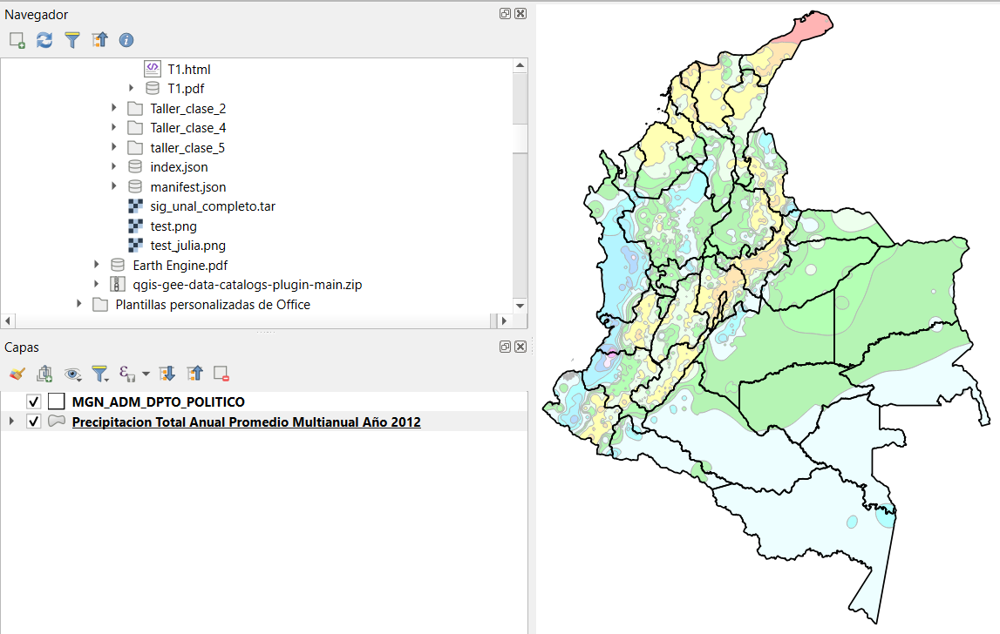

## Introducción
El presente documento reporta el ejercicio de integración de datos geoespaciales locales y remotos (OGC), siguiendo los principios de la Geomática moderna y Open Science. Se utilizan herramientas como QGIS y ArcGIS Pro para validar la interoperabilidad de la información geográfica de Colombia.

## Tabla de Fuentes
A continuación se detallan los recursos utilizados para la práctica:

| Tipo de Recurso | Nombre del Recurso / Archivo | URL de Conexión / Ruta Local | Sistema de Coordenadas |
|:---:|:---|:---|:---:|
| **WMS** | Mapa Base IGAC | <https://mapas.igac.gov.co/server/services/atlas/MapServer/WMSServer> | EPSG:4326 / 9377 |
| **WFS** | Límite Departamental (IGAC) | <https://mapas.igac.gov.co/server/services/cortoplazo/limites_politico_administrativos/MapServer/WFSServer> | EPSG:9377 |
| **WCS** | Modelo Digital de Elevación (IDEAM) | <http://dhime.ideam.gov.co/server/services/MDE/MapServer/WCSServer> | EPSG:4326 |
| **Shapefile** | municipios colombia.shp | Descargado de Datos Abiertos Colombia | EPSG:9377 |
| **GeoTIFF** | cobertura tierra.tif | Almacenamiento Local (Procesamiento propio) | EPSG:9377 |

: Detalle de fuentes de información y servicios geográficos utilizados {#tbl-fuentes tbl-colwidths="[10,25,50,15]"}

## Productos Cartográficos

### Mapa en QGIS

Esta imagen muestra un proyecto en ArcGIS Pro donde se visualiza el mapa de Colombia integrando exitosamente dos fuentes de información: un servicio WMS del IGAC sobre fenómenos amenazantes de origen geológico y una capa local de división política (MGN_ADM_DPTO_POLITICO). La superposición de estas capas permite identificar espacialmente zonas de riesgo (como actividad sísmica, volcanes y erosión) sobre la base de los departamentos del país, facilitando el análisis territorial y la gestión del riesgo a escala nacional.

::: {#fig-1}

Mapa de QGIS *(Captura de pantalla visualización WMS  en QGIS)*
:::

### Mapa en ArcGIS Pro
Esta imagen muestra un proyecto en ArcGIS Pro donde se visualiza el mapa de Colombia integrando exitosamente dos fuentes de información: un servicio WMS del IGAC sobre fenómenos amenazantes de origen geológico y una capa local de división política (MGN_ADM_DPTO_POLITICO). La superposición de estas capas permite identificar espacialmente zonas de riesgo (como actividad sísmica, volcanes y erosión) sobre la base de los departamentos del país, facilitando el análisis territorial y la gestión del riesgo a escala nacional.

::: {#fig-2}

Mapa de ArcGIS Pro *Captura de pantalla en Arcgis Pro - WMS*
:::

## Cuestionario de Análisis

### ¿Qué archivos/servicios permiten la edición de geometrías directamente?
Los archivos locales como el **Shapefile** permiten la edición directa de sus geometrías. En cuanto a servicios web, el estándar **WFS (Web Feature Service)** permite la edición si el servidor tiene habilitada la función de transacciones (WFS-T). El WMS y WCS no permiten edición de geometría ya que entregan imágenes o datos de cobertura, no entidades vectoriales editables por el cliente.

::: {#fig-3}
{fig-align="center" height="400px"}

Intento de Acceso a WFS de IGAC - Solicitud de credenciales para servicios geográficos institucionales.
:::

Como se observa en la @fig-3, se identificó una limitante significativa al intentar consumir el servicio WFS del IGAC desde ArcGIS Pro. A pesar de ser un estándar de interoperabilidad (OGC), el acceso está restringido por una capa de seguridad que requiere autenticación mediante un portal de ArcGIS Enterprise. Como se observa en la captura de pantalla, el software solicita credenciales institucionales específicas para el servidor 'Mapas 2', lo que impide el acceso libre y directo a los datos vectoriales para usuarios externos. Esta barrera técnica contradice en parte el principio de Open Data y obliga al analista a buscar fuentes alternativas o solicitar permisos de acceso al nodo oficial.

### ¿Cuáles permiten acceso a la tabla de atributos? Describa tres campos de uno de ellos.
Permiten el acceso el **WFS** y el **Shapefile**. 
En la imagen se observa el acceso a los archivos locales (como el Shapefile de departamentos MGN_ADM_DPTO_POLITICO) y los servicios de datos vectoriales como WFS o ArcGIS Feature Services (como el de precipitación que tienes abierto).

::: {#fig-4}
{fig-align="center" height="400px"}

Interfaz de QGIS - Integración de un servicio REST del IDEAM con la división departamental en QGIS para analizar rangos climáticos mediante la consulta de su tabla de atributos
:::

Tomando como ejemplo la tabla de la capa "Precipitacion Total Anual Promedio Multianual Año 2012" la  @fig-4 muestra tres campos importantes son:

**OBJECTID**: Es un campo numérico que funciona como un identificador único y automático para cada uno de los polígonos (registros) dentro de la base de datos.

**Rango**: Es un campo de tipo texto (String) que describe el intervalo de precipitación anual en milímetros (ej. "2500-3000mm"). Es el campo principal para la clasificación climática de la zona.

**st_area(shape)**: Es un campo numérico que representa el área geométrica calculada del polígono en unidades del sistema de coordenadas (en este caso, probablemente grados cuadrados por ser EPSG:4686, o metros si estuviera proyectado).

### ¿En qué casos fue posible cambiar la simbología desde el software cliente?
Fue posible cambiar la simbología en los archivos locales (Shapefile) y en los servicios ArcGIS REST / WFS.

En el Shapefile (Departamentos): Se pudo quitar el relleno para dejar solo el borde, permitiendo ver la capa inferior.
En el servicio REST (Precipitación): Se pudo manipular la transparencia (opacidad) y, en algunos casos, los estilos de color desde el software cliente (QGIS).

Contraste (El "No"): En el caso del servicio WMS (visto al inicio del taller), no fue posible cambiar la simbología, ya que el servidor envía una imagen fija con colores predeterminados que no pueden editarse en QGIS.

::: {#fig-simbologia layout-ncol=2}

{#fig-original}

{#fig-transparente}

**Comparativa de manipulación de simbología en QGIS: El software cliente permite ajustar la visualización de los datos provenientes del servicio REST del IDEAM.**
:::

### ¿Por qué es preferible usar un WFS sobre un Shapefile descargado en proyectos a largo plazo?
Es preferible porque el **WFS garantiza la actualización de los datos**. Si la entidad oficial (ej. IGAC) actualiza un límite municipal, el servicio WFS reflejará el cambio automáticamente. Un Shapefile es una "foto" estática del pasado que queda obsoleta y requiere descarga manual repetitiva, lo que puede llevar a trabajar con información desactualizada.

## Conclusiones
**Diferenciación de Servicios (WMS vs. REST/WFS)**: Se determinó que los servicios tipo WMS funcionan como representaciones gráficas estáticas (imágenes), ideales para mapas base pero limitados en análisis. Por el contrario, los servicios ArcGIS REST y WFS permiten una interacción dinámica con los datos, facultando al usuario para consultar tablas de atributos, realizar análisis espaciales y personalizar la simbología desde el software cliente (QGIS/ArcGIS Pro).

**Autonomía en la Representación Cartográfica**: A través del ejercicio de transparencia y cambio de estilos, se concluyó que la conexión a servicios vectoriales otorga al analista SIG control total sobre la visualización. Esto facilita la superposición de capas de distintas entidades (como la división política del IGAC y los rangos climáticos del IDEAM), permitiendo generar mapas temáticos complejos sin depender del diseño preestablecido por el servidor de origen.

**Ventajas de la Interoperabilidad Web sobre Datos Locales**: Se validó que el uso de geoservicios es superior al uso de archivos locales (como Shapefiles) en proyectos a largo plazo. Al conectarse directamente a las URL oficiales, se garantiza que la información esté permanentemente actualizada según los estándares de la entidad productora, evitando la obsolescencia de los datos y optimizando el almacenamiento en el disco local.

**Gestión de la Información Geográfica en Colombia**: La práctica evidenció la robustez pero también la intermitencia de la infraestructura de datos espaciales nacional. Mientras que servidores como el del IGAC (Atlas de Colombia) muestran alta estabilidad, los servicios del IDEAM pueden presentar fallos de conexión técnicos (errores de red o de Web Adaptor). Esto resalta la importancia de conocer fuentes alternativas como el SIAC o la ANLA para asegurar la continuidad de los flujos de trabajo en análisis ambiental y territorial.