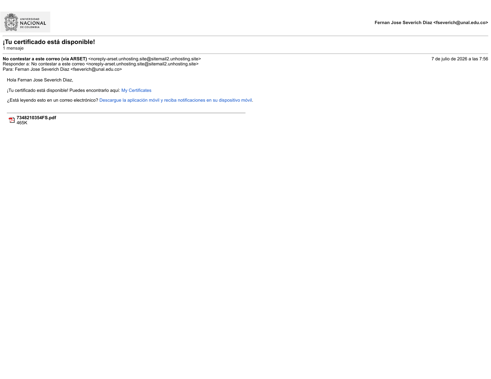
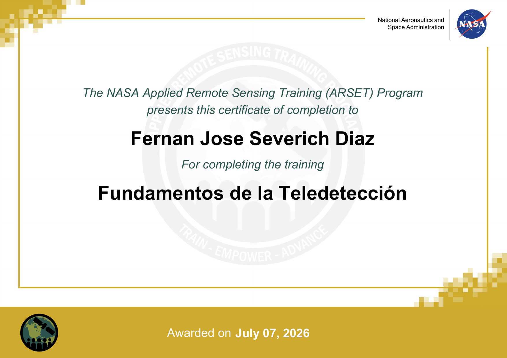

# Proposito del documento

El presente documento fue elaborado por **Fernan Severich Diaz** el **07 de julio de 2026** con el fin de dejar constancia academica de la realizacion y finalizacion satisfactoria del curso autoguiado de NASA ARSET titulado **"Fundamentos de la Teledeteccion"**.

Este resumen se presenta como soporte para demostrar ante el profesor que complete el proceso de formacion, realice la totalidad del contenido del curso y obtuve el certificado oficial de finalizacion.

# Identificacion del curso

- **Entidad:** NASA Applied Remote Sensing Training Program (ARSET).
- **Curso:** Fundamentos de la Teledeteccion.
- **Idioma:** Espanol.
- **Modalidad:** curso en linea autoguiado.
- **Nivel:** introductorio.
- **Duracion de referencia:** 2 horas.
- **Fecha de certificado:** 07 de julio de 2026.

La descripcion publica del curso indica que esta capacitacion introduce los principios cientificos de la teledeteccion satelital, las caracteristicas basicas de los satelites y sensores, los tipos de datos disponibles, las fortalezas y limitaciones del enfoque y algunas herramientas iniciales para visualizacion de datos, en particular **NASA Worldview**.

# Resumen de lo realizado

Durante la jornada de hoy complete el curso **Fundamentos de la Teledeteccion** en la plataforma ARSET. El proceso incluyo la revision completa de los contenidos autoguiados, el desarrollo de todos los modulos disponibles en el aula virtual y la finalizacion de los requisitos necesarios para la emision del certificado.

Desde una perspectiva academica, el curso me permitio reforzar conceptos fundamentales para el trabajo en geomatica y observacion de la Tierra. Entre los aprendizajes mas relevantes destaco los siguientes:

1. Comprendi mejor el papel de la teledeteccion satelital en el estudio de los sistemas terrestres.
2. Reforce la relacion entre radiacion electromagnetica, sensores remotos y obtencion de parametros geofisicos.
3. Identifique diferencias entre tipos y niveles de productos de teledeteccion.
4. Reconoci ventajas y limitaciones del uso de imagenes y datos satelitales en aplicaciones reales.
5. Revise el uso de herramientas de visualizacion como **NASA Worldview** para explorar datos por region y periodo de tiempo.

En mi formacion, este curso resulta pertinente porque complementa contenidos de analisis espacial, sistemas de informacion geografica, geomatica y manejo de datos geoespaciales. Ademas, aporta una base conceptual util para interpretar productos satelitales antes de emplearlos en ejercicios aplicados de procesamiento, cartografia y evaluacion territorial.

# Temas principales del curso

Con base en la informacion publica del curso y en la capacitacion realizada, los temas centrales desarrollados fueron:

1. Uso de la teledeteccion satelital para estudiar ecosistemas y sistemas terrestres.
2. Propiedades de la superficie y de la atmosfera que pueden observarse desde el espacio.
3. Funcionamiento general de satelites y sensores remotos.
4. Medicion de la radiacion electromagnetica y su relacion con variables geofisicas.
5. Niveles de productos de teledeteccion y formas basicas de trabajo con dichos datos.
6. Fortalezas, limitaciones y criterios de uso adecuado de la teledeteccion.
7. Uso introductorio de **NASA Worldview** como herramienta de consulta y visualizacion.

# Valor academico de la capacitacion

Considero que esta capacitacion tiene valor academico y practico porque fortalece la comprension de conceptos esenciales previos a cualquier trabajo con imagenes satelitales. En particular, aporta bases para:

- seleccionar fuentes de datos adecuadas segun el problema de estudio;
- interpretar la calidad y el nivel de procesamiento de los productos remotos;
- comprender de forma mas critica los alcances y limitaciones de la observacion de la Tierra;
- conectar fundamentos teoricos con herramientas reales de acceso abierto desarrolladas por NASA.

En ese sentido, el curso no solo certifica una actividad cumplida, sino que tambien contribuye directamente a mi proceso de formacion en geomatica.

# Evidencias de finalizacion

## Correo de confirmacion

La siguiente imagen corresponde al correo recibido el **07 de julio de 2026**, en el cual la plataforma ARSET informa que el certificado se encuentra disponible.

{fig-align="center" width="90%"}

## Certificado obtenido

La siguiente imagen corresponde al certificado oficial emitido por **The NASA Applied Remote Sensing Training (ARSET) Program** a nombre de **Fernan Jose Severich Diaz** por completar la capacitacion **Fundamentos de la Teledeteccion**.

{fig-align="center" width="90%"}

# Conclusiones

En conclusion, el dia **07 de julio de 2026** complete satisfactoriamente el curso **Fundamentos de la Teledeteccion** de **NASA ARSET**, desarrolle todos los modulos propuestos en la plataforma y obtuve el certificado de finalizacion correspondiente.

Este documento resume la actividad realizada y adjunta las evidencias principales de cumplimiento: el correo de confirmacion y el certificado expedido por la plataforma.

# Fuente consultada

- NASA Earthdata. **Fundamentos de la Teledeteccion**: <https://www.earthdata.nasa.gov/es/learn/trainings/fundamentos-de-la-teledeteccion>
